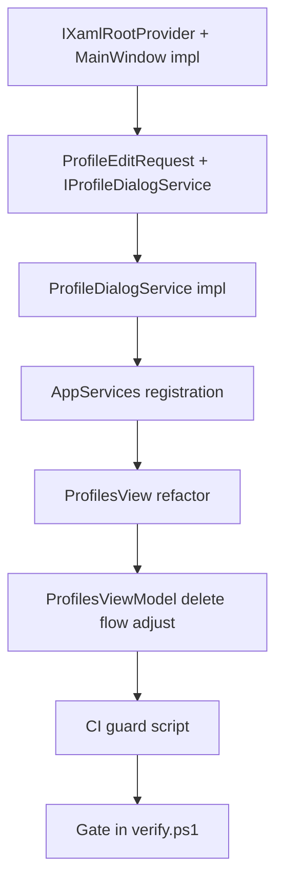

# Dialog Architecture Bulletproof Plan

**Status**: Draft  
**Created**: 2026-03-10  
**Scope**: Centralize `ContentDialog` and `XamlRoot` usage; typed profile workflows; CI enforcement

---

## 1. High-Level Goal Clarification

### Goal Statement

Make the dialog architecture **boring, centralized, and hard to misuse**. No view or ViewModel ever creates or shows a popup directly; they request typed workflows from dialog services that alone own `ContentDialog`, `XamlRoot`, failure handling, and fallback behavior, with CI blocking any violations.

### Assumptions

- WinUI 3 `ContentDialog` requires `XamlRoot`; the root is the `Window` (MainWindow).
- PanelRegistry currently uses `Activator.CreateInstance(ViewType)` — no view DI.
- Service locator (`AppServices.TryGetService<T>()`) exists and is used for non-View services.
- We can add CI checks (grep/script) that fail builds on policy violation.

### Stakeholders

| Role | Responsibility |
|------|----------------|
| UI authors | Call typed dialog interfaces; never touch `ContentDialog` or `XamlRoot` |
| Dialog service | Own all popup construction, root resolution, soft failure |
| CI | Fail when forbidden patterns appear outside approved files |

### Constraints

- **Technical**: Must not break existing flows; migration is phased.
- **Scope**: Profiles workflow first (template); broad migration is a follow-up.
- **Backward compatibility**: ConfirmationDialog and ErrorDialogService are widely used; consolidate gradually.

### Scope

- **In Scope (MVP)**:
  - Introduce `IProfileDialogService`, `ProfileEditRequest`, `IXamlRootProvider`.
  - Implement `ProfileDialogService`; refactor ProfilesView to use it.
  - Migrate Profiles delete flow from ConfirmationDialog to ProfileDialogService.
  - Add CI guard for `new ContentDialog`, `.ShowAsync()`, `XamlRoot =` outside approved files.
- **In Scope (Future)**:
  - Migrate remaining 40+ view files and 2 ViewModels that create ContentDialog.
  - Migrate ConfirmationDialog and generic dialogs through a central service.
  - Panel registry view DI (constructor injection for dialog services).
- **Out of Scope**:
  - Changing WinUI 3 ContentDialog behavior.
  - Replacing service locator globally (separate ADR-030 migration).

---

## 2. Current State (Honest Assessment)

### What’s Good

- ProfilesView no longer creates raw `ContentDialog`; it routes through `DialogService.ShowInputAsync` and `DialogService.ShowProfileEditAsync`.
- `DialogService.GetXamlRoot()` exists and fails soft (returns null, logs).
- Progress made compared to the original “any view author can do `new ContentDialog`” pattern.

### What’s Weak (Per Mentor Critique)

1. **Service locator in view**: ProfilesView pulls `AppServices.TryGetDialogService()` — not injected.
2. **View knows too much**: View assembles prompts (`"Create New Profile"`, `"Profile name"`) and workflow details.
3. **Fake abstraction**: Edit path casts to concrete `DialogService` to call `ShowProfileEditAsync` — the interface doesn’t expose it.
4. **No enforcement**: Any developer can reintroduce `new ContentDialog` in a view and CI won’t catch it.

### Violation Inventory (Grep Results)

| Location | `new ContentDialog` | `XamlRoot` |
|----------|--------------------|------------|
| **DialogService.cs** | ✓ (approved) | ✓ |
| **ErrorDialogService.cs** | ✓ (approved) | ✓ |
| **ConfirmationDialog.cs** | ✓ (utility, to migrate) | ✓ |
| **Views/Panels/*.xaml.cs** | **~35 files** | All use `this.XamlRoot` |
| **ViewModels/** (LibraryViewModel, PresetLibraryViewModel) | 2 files | `GetXamlRoot()` |
| **MainWindow.xaml.cs** | 4+ sites | Multiple |
| **Views/Dialogs/*.cs** | WorkspaceManagerDialog, etc. | Multiple |
| **Utilities/** | ConfirmationDialog | — |

**Conclusion**: Current architecture is **soft**. One panel fixed; dozens still violate. Without CI, this will regress.

---

## 3. Target Architecture

### Rule 1: Only One Layer Creates ContentDialog

**Allowed**:

- `Services/ProfileDialogService.cs` (new)
- `Services/DialogService.cs` (existing, generic)
- `Services/ErrorDialogService.cs` (existing)
- `Utilities/ConfirmationDialog.cs` (temporary; migrate to service)

**Forbidden**:

- `Views/**/*.xaml.cs`
- `ViewModels/**/*.cs`
- Any helper or utility not in the approved list.

### Rule 2: Only One Layer Touches XamlRoot

The dialog/root host service resolves `XamlRoot`. Nobody else.

### Rule 3: Feature Workflows Get Typed Methods

No string-soup prompts. Callers ask for a workflow by type.

---

## 4. Abstractions and DTOs

### IXamlRootProvider

```csharp
namespace VoiceStudio.Core.Services;

public interface IXamlRootProvider
{
    XamlRoot? TryGetRoot();
}
```

**Implementation**:

```csharp
public sealed class MainWindowXamlRootProvider : IXamlRootProvider
{
    private readonly Window _window;

    public MainWindowXamlRootProvider(Window window) => _window = window ?? throw new ArgumentNullException(nameof(window));

    public XamlRoot? TryGetRoot() =>
        (_window.Content as FrameworkElement)?.XamlRoot;
}
```

**Registration**: Singleton, bound to MainWindow in AppServices.

### ProfileEditRequest

```csharp
namespace VoiceStudio.App.Services.Profiles;

public sealed record ProfileEditRequest(
    string Name,
    string Language,
    string Emotion,
    string Tags);
```

**Note**: `Tags` as string; ViewModel splits by comma (or uses a delimiter). Backend expects `List<string>`; conversion in ViewModel/UseCase.

### IProfileDialogService

```csharp
namespace VoiceStudio.App.Services.Profiles;

public interface IProfileDialogService
{
    Task<string?> ShowCreateProfileNameAsync();
    Task<ProfileEditRequest?> ShowEditProfileAsync(ProfileEditRequest initial);
    Task<bool> ConfirmDeleteProfileAsync(string profileName);
}
```

---

## 5. ProfileDialogService Implementation

- **Location**: `src/VoiceStudio.App/Services/Profiles/ProfileDialogService.cs`
- **Dependencies**: `IXamlRootProvider`, `IErrorLoggingService?` (optional, for warnings)
- **Behavior**:
  - All methods call `_rootProvider.TryGetRoot()` first.
  - If null: log warning, return `null`/`false` (soft fail).
  - Create `ContentDialog`, set `XamlRoot = root`, show, return result.
- **Create**: Single `TextBox`, placeholder "Enter profile name...", Primary "Create", Close "Cancel".
- **Edit**: Four `TextBox` (Name, Language, Emotion, Tags) in `StackPanel`.
- **Delete**: Content = message, Primary "Delete", Close "Cancel", Default = Close.

**All `new ContentDialog` and `XamlRoot =` live in this one file** (plus existing DialogService/ErrorDialogService for their scopes).

---

## 6. ProfilesView Refactor

### Before (Current)

```csharp
var dialogService = AppServices.TryGetDialogService();
if (dialogService is DialogService ds)
{
    var editResult = await ds.ShowProfileEditAsync(...);
}
```

### After (Target)

```csharp
private readonly IProfileDialogService _profileDialogs;

public ProfilesView()
{
    InitializeComponent();
    _profileDialogs = AppServices.GetRequiredService<IProfileDialogService>();
}

private async void CreateProfileButton_Click(object sender, RoutedEventArgs e)
{
    try
    {
        var name = await _profileDialogs.ShowCreateProfileNameAsync();
        if (!string.IsNullOrWhiteSpace(name))
            await ViewModel.CreateProfileCommand.ExecuteAsync(name);
    }
    catch (Exception ex)
    {
        _errorLoggingService?.LogError(ex, "CreateProfileButton_Click");
    }
}

private async void HandleProfileMenuClick(string action, VoiceProfile? profile)
{
    switch (action.ToLowerInvariant())
    {
        case "edit":
            if (profile == null) return;
            var edit = await _profileDialogs.ShowEditProfileAsync(
                new ProfileEditRequest(
                    profile.Name ?? string.Empty,
                    profile.Language ?? string.Empty,
                    profile.Emotion ?? string.Empty,
                    profile.Tags != null ? string.Join(", ", profile.Tags) : string.Empty));
            if (edit != null)
                await ViewModel.UpdateProfileAsync(profile, edit.Name, edit.Language, edit.Emotion, edit.Tags);
            break;

        case "delete":
            if (profile == null || string.IsNullOrWhiteSpace(profile.Id)) return;
            var confirmed = await _profileDialogs.ConfirmDeleteProfileAsync(profile.Name ?? "profile");
            if (confirmed)
                await ViewModel.DeleteProfileCommand.ExecuteAsync(profile.Id);
            break;

        // ... other cases
    }
}
```

**ViewModel changes**:

- **Delete flow**: Today `ProfilesViewModel.DeleteProfileAsync` shows `ConfirmationDialog.ShowDeleteConfirmationAsync` and then deletes. Per mentor’s design, the **View** owns confirmation. Flow:
  1. View calls `_profileDialogs.ConfirmDeleteProfileAsync(profile.Name ?? "profile")`.
  2. If true, View calls `ViewModel.DeleteProfileCommand.ExecuteAsync(profile.Id)`.
  3. ViewModel `DeleteProfileAsync` **no longer shows confirmation** — it performs the delete only. The command assumes the caller has already confirmed.
- Remove the `ConfirmationDialog.ShowDeleteConfirmationAsync` call from `ProfilesViewModel.DeleteProfileAsync`.
- **Batch delete** (`DeleteSelectedAsync`): Uses `ConfirmationDialog` for “Delete N profile(s)?”. Phase 1 leaves this as-is; Phase 2 can add `ConfirmDeleteProfilesAsync(int count)` to `IProfileDialogService`.

---

## 7. CI Enforcement

### Script: `scripts/ci/check_dialog_policy.py`

**Logic**:

1. Grep for `new ContentDialog` — allowed only in:
   - `Services/DialogService.cs`
   - `Services/ErrorDialogService.cs`
   - `Services/Profiles/ProfileDialogService.cs`
   - `Utilities/ConfirmationDialog.cs` (until migrated)
2. Grep for `ContentDialog` + `.ShowAsync()` — same allowlist.
3. Grep for `XamlRoot =` — same allowlist (+ `Views/Dialogs/` if they are approved hosts).

**Output**: Exit 1 if any match is outside the allowlist; print violating file:line.

**Integration**: Add to `verify.ps1` or `.github/workflows/ci.yml` as a gate.

### Approved Files (Initial)

| File | Rationale |
|------|-----------|
| `Services/DialogService.cs` | Generic dialogs |
| `Services/ErrorDialogService.cs` | Error presentation |
| `Services/Profiles/ProfileDialogService.cs` | Profile workflows |
| `Utilities/ConfirmationDialog.cs` | Interim; deprecate when migrated |

All `Views/**/*.xaml.cs`, `ViewModels/**/*.cs` must be **forbidden**. Any new `new ContentDialog` there = CI fail.

---

## 8. Phased Implementation

### Phase 1: Profiles Bulletproof (This Plan)

| Step | Task | Files |
|------|------|-------|
| 1.1 | Add `IXamlRootProvider`, `MainWindowXamlRootProvider` | Core/Services, App/Services |
| 1.2 | Add `ProfileEditRequest`, `IProfileDialogService` | App/Services/Profiles |
| 1.3 | Implement `ProfileDialogService` | App/Services/Profiles/ProfileDialogService.cs |
| 1.4 | Register in AppServices (singleton) | AppServices.cs |
| 1.5 | Refactor ProfilesView to use `IProfileDialogService` | ProfilesView.xaml.cs |
| 1.6 | Move delete confirmation from ViewModel to View; remove ConfirmationDialog from Profiles flow | ProfilesView, ProfilesViewModel |
| 1.7 | Remove `ShowProfileEditAsync` from `IDialogService`/`DialogService` (or keep for backward compat, mark obsolete) | DialogService.cs |
| 1.8 | Add `scripts/ci/check_dialog_policy.py` | New script |
| 1.9 | Add CI gate (fail on Profiles + any new violations) | verify.ps1 or ci.yml |

**Verification**: `dotnet build`, `dotnet test`, `python scripts/ci/check_dialog_policy.py` → PASS. Profiles create/edit/delete flows work.

### Phase 2: Broader Migration (Future)

- Migrate remaining panels one-by-one to typed dialog services or `IDialogService` generic methods.
- Migrate `ConfirmationDialog` callers to a central `IConfirmationDialogService`.
- Migrate ViewModels (LibraryViewModel, PresetLibraryViewModel) to use dialog services.
- Shrink ConfirmationDialog allowlist; eventually remove it.

### Phase 3: View DI (Optional)

- Extend PanelRegistry / descriptor to support view factories with DI.
- Inject `IProfileDialogService` into ProfilesView constructor.
- Remove service locator from ProfilesView.

---

## 9. Dependency Order



---

## 10. Risks and Mitigations

| Risk | Likelihood | Impact | Mitigation |
|------|------------|--------|------------|
| ProfilesViewModel has other callers of delete confirmation | Medium | Medium | Audit all delete paths; ensure View is sole entry for user-triggered delete |
| CI guard too strict, blocks valid code | Low | Medium | Start with narrow allowlist; expand only with explicit justification |
| PanelRegistry can’t inject view deps | High | Low | Phase 1 uses service locator; Phase 3 fixes registry |
| ProfileEditRequest Tags format differs from backend | Low | Low | ViewModel converts `string` ↔ `List<string>` at boundary |

---

## 11. Rollback

- Phase 1 is isolated. Revert ProfilesView + ProfileDialogService + interfaces.
- Remove CI guard if it blocks legitimate work; fix policy first, then re-enable.
- Keep `DialogService.ShowProfileEditAsync` until Profiles migration verified; then deprecate.

---

## 12. Definition of Done (Phase 1)

- [ ] `IProfileDialogService`, `ProfileEditRequest`, `IXamlRootProvider` defined and used
- [ ] `ProfileDialogService` implemented; all profile dialogs use it
- [ ] ProfilesView uses `IProfileDialogService`; no cast to `DialogService`; no raw `ContentDialog`
- [ ] Profiles delete confirmation via `ConfirmDeleteProfileAsync`; ViewModel delete path assumes pre-confirmed
- [ ] CI guard script exists and passes for Profiles scope
- [ ] No regressions: create, edit, delete profile flows work
- [ ] `scripts/verify.ps1 -Quick` green

---

## 13. Changelog

| Date | Change |
|------|--------|
| 2026-03-10 | Initial plan; mentor critique incorporated |
