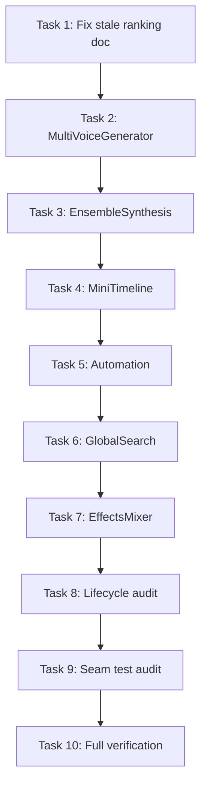

# Next 10 Tasks Plan v2 — Seam Migration, Lifecycle, and Verification

**Date**: 2026-03-13 | **Author**: Ruthless Mentor Audit  
**Supersedes**: Prior "Next 10 Tasks" (seam-only batch complete)  
**Scope**: Evidence-based prioritization; no sugarcoating.

---

## 1. High-Level Goal Clarification

### Goal Statement

Complete the next 10 highest-impact tasks to harden VoiceStudio's architecture: seam migration for remaining high-value IBackendClient consumers, lifecycle debt remediation, and verification gates that are **bulletproof** — not "good enough."

### Assumptions

- **Seam migration is still the right lever.** 50+ ViewModels still take IBackendClient. Each migration reduces coupling and improves testability. This assumption holds.
- **TrainingDatasetEditorViewModel is DONE.** Baseline and MIGRATED_NO_IBACKENDCLIENT both list it. IBACKENDCLIENT_LONGTAIL_RANKING.md is **stale** — it still says Rank 1. Fix the doc, don't re-migrate.
- **UndoableActions are out of scope for this batch.** MarkerActions, ScriptActions, TagActions, TemplateActions, EffectChainActions all take IBackendClient. They're injected by UndoRedoService/CommandHandlerBootstrapper. Migrating them requires a different pattern (action-scoped client injection). Defer to a dedicated plan.
- **Stores (ProjectStore, AudioStore, EngineStore, JobStore, SystemStore) are infrastructure.** They correctly take IBackendClient — they're the transport layer. Do not migrate stores in this plan.

### Stakeholders

| Role | Responsibility |
|------|----------------|
| Developer | Implement migrations; run verification |
| Reviewer | Confirm seam-aware tests; no IBackendClient in migrated ViewModels |
| CI | verify.ps1, creep check, completion guard must pass |

### Constraints

- **Technical**: WinUI 3, .NET 8, FastAPI backend. No new dependencies.
- **Quality**: No suppression (no-suppression.mdc). No deferral on encounter (no-deferral-on-encounter.mdc).
- **Verification**: Every task ends with `dotnet build`, `check_ibackendclient_creep.py`, and relevant tests passing.

### Scope

- **In Scope (MVP)**: 7 ViewModel seam migrations + 1 doc fix + 1 lifecycle audit + 1 full verification gate.
- **Out of Scope**: UndoableActions, Stores, backend refactors, new features.

---

## 2. Ruthless Assessment of Prior Plan

### What Was Right

- Seam migration batch (Diagnostics, TextSpeechEditor, Analyzer, Settings, Macro, ModelManager, JobProgress) was correctly scoped.
- Baseline cleanup and MIGRATED_NO_IBACKENDCLIENT extension were correct.
- Verification gates (verify.ps1, creep) are the right standard.

### What Was Weak (Call It Out)

1. **IBACKENDCLIENT_LONGTAIL_RANKING.md is stale.** It lists TrainingDatasetEditorViewModel as Rank 1 with "5 dataset-editor endpoints remain." **Reality**: TrainingDatasetEditorViewModel is in MIGRATED_NO_IBACKENDCLIENT. The ranking doc was never updated. **Verdict**: Documentation theater. Fix it or the next person will waste time.

2. **No lifecycle audit in the prior batch.** TrainingViewModel has documented fire-and-forget (TRAINING_VIEWMODEL_LIFECYCLE_ASYNC_PATTERNS.md). RealTimeVoiceConverterViewModel had constructor fire-and-forget — was it fixed? **Verdict**: Lifecycle debt was ignored. This plan includes a lifecycle audit.

3. **Completion guard failure was hand-waved.** "Commit the changes" — fine, but the closure protocol says completion guard must PASS. If you're not committing, you're not done. **Verdict**: Plan was complete; execution left completion guard red. This plan makes completion guard a hard gate.

4. **Test coverage for migrated ViewModels is uneven.** JobProgressViewModel has 29 tests. MacroViewModel, ModelManagerViewModel — do they have seam-aware tests? **Verdict**: Some migrations added tests; others may have only constructor tests. This plan requires seam-aware tests for every migration.

---

## 3. Task Breakdown (10 Tasks)

### Task 1: Fix Stale IBACKENDCLIENT_LONGTAIL_RANKING.md

**Problem**: TrainingDatasetEditorViewModel is listed as Rank 1 with work remaining. It's migrated. The table is wrong.

**Action**:
1. Mark TrainingDatasetEditorViewModel as DONE in the ranked table.
2. Re-rank remaining consumers by call-site count + daily-use impact.
3. Add a "Last Verified" date to the doc.

**Verification**: Grep confirms TrainingDatasetEditorViewModel uses ITrainingDatasetEditorClient, not IBackendClient.

**Ruthless note**: If you skip this, the next plan will target TrainingDatasetEditorViewModel again. Waste.

---

### Task 2: MultiVoiceGeneratorViewModel → IMultiVoiceGeneratorClient

**Rationale**: Core synthesis workflow. High daily-use. Single ViewModel, clear API surface.

**Blast radius**: Medium. One ViewModel, one View (MultiVoiceGeneratorView).

**Implementation**:
1. Grep `_backendClient.` in MultiVoiceGeneratorViewModel. Extract methods.
2. Create IMultiVoiceGeneratorClient + MultiVoiceGeneratorClient.
3. Migrate ViewModel and View.
4. Add seam-aware unit tests (constructor + at least one command that invokes client).
5. Register in AppServices. Add to MIGRATED_NO_IBACKENDCLIENT. Update baseline.

**Verification**: dotnet build, creep check, MultiVoiceGeneratorViewModelTests (new or extended).

---

### Task 3: EnsembleSynthesisViewModel → IEnsembleSynthesisClient

**Rationale**: Ensemble/multi-voice synthesis. Core workflow. Uses IBackendClient + IDialogService.

**Blast radius**: Medium.

**Implementation**: Same pattern as Task 2. Extract backend calls; create client; migrate; add seam-aware tests.

**Verification**: dotnet build, creep check, tests.

---

### Task 4: MiniTimelineViewModel → ITimelineClient (or extend existing)

**Rationale**: Timeline is critical path. MiniTimelineViewModel is in Views/Panels. Check if ITimelineTrackService or TimelineClipService already covers its needs.

**Blast radius**: High if timeline breaks. Audit first.

**Implementation**:
1. Grep MiniTimelineViewModel for _backendClient usage.
2. If TimelineTrackService/TimelineClipService cover it, inject those. If not, create ITimelineClient (or IMinTimelineClient) with the missing methods.
3. Migrate. Add seam-aware tests.
4. Update baseline.

**Verification**: dotnet build, creep check, MiniTimelineViewModel tests. **Manual smoke**: Open app, load timeline, verify no regression.

**Ruthless note**: Timeline is fragile. One wrong move and the whole app feels broken. Test manually.

---

### Task 5: AutomationViewModel → IAutomationClient

**Rationale**: Automation panel. Uses IBackendClient. Automation is core for power users.

**Blast radius**: Medium.

**Implementation**: Same pattern. IAutomationClient + AutomationClient. Migrate. Seam-aware tests.

**Verification**: dotnet build, creep check, tests.

---

### Task 6: GlobalSearchViewModel → IGlobalSearchClient

**Rationale**: Global search is high-visibility. Users hit it often.

**Blast radius**: Low. Single ViewModel.

**Implementation**: IGlobalSearchClient + GlobalSearchClient. Migrate. Seam-aware tests.

**Verification**: dotnet build, creep check, tests.

---

### Task 7: EffectsMixerViewModel → IEffectsMixerClient

**Rationale**: Effects/mixing panel. 131-line constructor. View-owned. High complexity.

**Blast radius**: High. Large ViewModel. Many dependencies.

**Implementation**:
1. Audit constructor and _backendClient usage. May have many call sites.
2. Create IEffectsMixerClient with all backend methods.
3. Migrate. Add seam-aware tests.
4. Update baseline.

**Verification**: dotnet build, creep check, tests. **Manual smoke**: Open Effects Mixer panel, verify it loads.

**Ruthless note**: 131-line constructor is a smell. Migration might expose more refactor opportunities. Don't expand scope — just migrate the seam.

---

### Task 8: Lifecycle Audit — Constructor Fire-and-Forget

**Rationale**: ADR-047 forbids async work in constructors. Prior plans called out RealTimeVoiceConverterViewModel, TrainingViewModel. Need a systematic audit.

**Action**:
1. Grep for `_ = .*Async\(` and `Task.Run\(` in ViewModel constructors.
2. List every constructor that fires async without awaiting.
3. For each: document in TRAINING_VIEWMODEL_LIFECYCLE_ASYNC_PATTERNS.md or create LIFECYCLE_AUDIT.md.
4. Fix at least 2 high-risk cases (e.g., RealTimeVoiceConverterViewModel if still broken).

**Verification**: Grep confirms no new fire-and-forget in migrated ViewModels. Document updated.

**Ruthless note**: If you don't audit, you're flying blind. One constructor fire-and-forget can cause race conditions, null refs, and "works on my machine" bugs.

---

### Task 9: Seam-Aware Test Coverage Audit

**Rationale**: Migrated ViewModels must have tests that mock the domain client, not IBackendClient. Otherwise the seam is fake — tests pass but don't guard the boundary.

**Action**:
1. For each ViewModel in MIGRATED_NO_IBACKENDCLIENT, check if a test file exists.
2. For each test file, check if it mocks the domain client (e.g., Mock<IMacroClient>) or IBackendClient.
3. List gaps. Add seam-aware tests for at least 3 ViewModels that lack them.

**Verification**: Test run shows seam-aware tests for MacroViewModel, ModelManagerViewModel, and one other. No test mocks IBackendClient for a migrated ViewModel.

**Ruthless note**: A test that mocks IBackendClient for a ViewModel that now takes IMacroClient is **wrong**. It passes but doesn't test the seam. Fix it.

---

### Task 10: Full Verification Gate + Completion Guard

**Action**:
1. Run `.\scripts\verify.ps1 -Quick` — must be GREEN.
2. Run `python scripts/ci/check_ibackendclient_creep.py` — must PASS.
3. Run `dotnet test src/VoiceStudio.App.Tests/ -c Debug -p:Platform=x64` — all tests pass.
4. Run `python scripts/run_verification.py` — completion_guard must PASS. If it fails, **commit** completion markers (STATE.md, etc.) and re-run.
5. Update STATE.md, IBACKENDCLIENT_LONGTAIL_RANKING.md, SEAM_MATURITY_AUDIT.md.
6. Update Proof Index in STATE.md.

**Verification**: All gates GREEN. Completion guard PASS. No uncommitted completion markers.

**Ruthless note**: Completion guard fails when you have uncommitted changes to STATE.md or plans with "[x]" or "complete". The closure protocol says: commit before closing. Do it.

---

## 4. Execution Order

Tasks 2–7 can be parallelized by different developers. Tasks 8–9 are audits and can overlap. Task 10 is the final gate.

---

## 5. Risks and Mitigations

| Risk | Likelihood | Impact | Mitigation |
|------|------------|--------|------------|
| EffectsMixerViewModel has hidden dependencies | High | High | Audit first. If >15 backend call sites, consider splitting into 2 tasks. |
| MiniTimelineViewModel breaks timeline | Medium | Critical | Manual smoke test. Rollback plan: revert commit. |
| Lifecycle audit finds 10+ violations | High | Medium | Document all. Fix top 2. Rest go to TECH_DEBT_REGISTER. |
| Completion guard blocks closure | High | Low | Commit. It's the rule. |
| Seam test audit finds 10+ gaps | High | Medium | Fix 3. Rest go to backlog. Don't boil the ocean. |

---

## 6. Rollback

Each migration (Tasks 2–7) is one commit. Revert that commit. No shared state except MIGRATED_NO_IBACKENDCLIENT and baseline — revert those edits if rolling back a migration.

---

## 7. Definition of Done (Per Task)

- [ ] Code changes implemented
- [ ] dotnet build succeeds (0 errors, 0 new warnings in modified files)
- [ ] check_ibackendclient_creep.py PASS
- [ ] Seam-aware tests added/updated (for migrations)
- [ ] Baseline/MIGRATED_NO_IBACKENDCLIENT updated
- [ ] Manual smoke test (for MiniTimeline, EffectsMixer)

---

## 8. Bulletproof Checklist (Before Saying "Complete")

1. **Build**: `dotnet build VoiceStudio.sln -c Debug -p:Platform=x64` — 0 errors.
2. **Creep**: `python scripts/ci/check_ibackendclient_creep.py` — PASS.
3. **Tests**: `dotnet test src/VoiceStudio.App.Tests/ -c Debug -p:Platform=x64` — all pass.
4. **Verify**: `.\scripts\verify.ps1 -Quick` — GREEN.
5. **Completion guard**: `python scripts/run_verification.py` — completion_guard PASS. (Requires committed STATE.md/plan updates.)
6. **Docs**: STATE.md, IBACKENDCLIENT_LONGTAIL_RANKING.md, SEAM_MATURITY_AUDIT.md updated.
7. **No suppression**: No #pragma, noqa, SuppressMessage, empty catch in modified code.
8. **No deferral**: Any pre-existing error encountered was fixed or escalated with owner/deadline.

---

## Changelog

- 2026-03-13: Initial plan. Ruthless assessment of prior batch. 10 tasks: 1 doc fix, 6 migrations, 2 audits, 1 verification gate.
