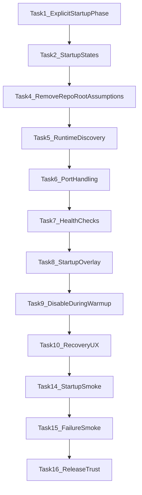

# Startup Orchestration Hardening Plan

**Status:** Accepted  
**Last Updated:** 2026-03-14  
**Last verified against code:** 2026-03-14  
**Related:** BackendProcessManager, App.xaml.cs, Program.cs

## Context

The requirement is correct: **double-click app icon → frontend opens → backend auto-starts → product usable without manual ritual.** Anything less is amateur-hour deployment UX.

**Current state (verified 2026-03-14):**

- **Backend startup:** Explicit phases in `OnLaunched`; UI smoke awaits `EnsureBackendWithTrackingAsync` before MainWindow; normal launch uses `StartBackendWithTracking` with state tracking. No fire-and-forget in constructor.
- **Root discovery:** `FindAppRoot()` — `VOICESTUDIO_APP_ROOT` env, exe dir, exe parent, dev walk-up (DEBUG only). No hardcoded paths.
- **Port:** From `VOICESTUDIO_API_PORT` or parsed from `BackendClientConfig.BaseUrl`.
- **Startup overlay:** Full-window overlay until BackendReady or BackendFailed; Retry button wired to `EnsureBackendRunningAsync`.
- **Single-instance:** [Program.cs](src/VoiceStudio.App/Program.cs) — mutex `VoiceStudio_SingleInstance_Mutex_v1`; backend ownership is separate.

**Weak idea to kill:** "Backend already starts in App.xaml.cs, so this is basically solved."  
**Reality:** Round 1 implemented explicit phases, overlay, and production runtime discovery. Round 2 completed: truth sync, backend ownership policy, failure-mode proof, icon-launch proof, release-trust integration.

---

## Desired Launch Behavior

1. User clicks VoiceStudio icon
2. App launches once
3. Backend is guaranteed reachable or the app shows an explicit startup state
4. Main UI does not feel broken during backend warmup
5. If backend startup fails, the user sees a clear recovery path
6. No separate manual backend launch step is required

---

## Phase 1 — Establish Launch Truth and Ownership

### Task 1: Make backend startup a first-class startup phase [x] Implemented

**Current:** [App.xaml.cs](src/VoiceStudio.App/App.xaml.cs) — explicit phases in OnLaunched; EnsureBackendWithTrackingAsync (UI smoke), StartBackendWithTracking (normal launch).

**Refactor:** Launch into explicit phases:

1. Initialize services
2. Ensure backend runtime state (tracked, not fire-and-forget)
3. Create main window
4. Transition UI from startup state to ready state

**Option:** Show main window early but not as if fully ready; or gate window creation until backend is ready.

### Task 2: Define startup states explicitly [x] Implemented

Add a simple startup-state model such as:

- `Starting`
- `BackendStarting`
- `BackendReady`
- `BackendFailed`
- `Degraded`

Use that state to drive:

- Splash/loading overlay
- Disabled interactions where appropriate
- Visible user messaging

**Location:** New service or `App.xaml.cs` state; surface to shell via event or property.

### Task 3: Decide backend ownership policy

Explicit rule set:

- If backend already healthy on expected endpoint → reuse
- If port occupied by non-VoiceStudio process → fail clearly
- If stale VoiceStudio backend exists → decide whether to reuse or restart
- If frontend exits → decide whether backend stops or is left alive

Document in `docs/design/` or ADR.

---

## Phase 2 — Make Backend Startup Production-Grade

### Task 4: Remove repo-root and hardcoded-drive assumptions [x] Implemented

**Current:** [BackendProcessManager.cs](src/VoiceStudio.App/Services/BackendProcessManager.cs) — `FindAppRoot()` uses VOICESTUDIO_APP_ROOT, exe dir, exe parent, dev walk-up (DEBUG only). No hardcoded paths.

**Replace with:** Runtime strategy that works for dev, local unpackaged, installed, portable:

1. Configured runtime/app base path (env or config)
2. Installed bundled runtime path
3. Portable relative path
4. Explicit override via environment/config
5. Dev fallback only in debug/dev mode

**Hardcoded `E:\VoiceStudio` must not be part of production startup logic.**

### Task 5: Make Python/runtime discovery explicit and deterministic [x] Implemented

**Current:** [BackendProcessManager.cs](src/VoiceStudio.App/Services/BackendProcessManager.cs) — Runtime/python/python.exe, venv/Scripts/python.exe, .venv/Scripts/python.exe; explicit error messages.

**Clean model:**

- Installed runtime path
- Dev runtime path
- Portable runtime path

**Requirement:** Startup log exactly which runtime path was chosen and why.

### Task 6: Make backend port handling robust

**Current:** Fixed port 8000; [BackendProcessManager.cs:114-126](src/VoiceStudio.App/Services/BackendProcessManager.cs) — `IsPort8000InUseAsync`; port collision message exists but UX is Debug-only.

**Decision:** Keep fixed port **only if**:

- Collisions handled cleanly
- Stale backend detection reliable
- User gets clear message when port occupied by another process

**Alternative:** Use `VOICESTUDIO_API_PORT` (already in [AppServices.cs:81](src/VoiceStudio.App/Services/AppServices.cs)) consistently.

### Task 7: Tighten backend health/readiness checks

**Current:** [BackendProcessManager.cs:265-274](src/VoiceStudio.App/Services/BackendProcessManager.cs) — `WaitForHealthAsync` 30s timeout; `BackendStartFailed` event.

**Add:**

- Startup timeout behavior
- Explicit UI state if timeout occurs
- Retry strategy
- Visible error with actionable steps

---

## Phase 3 — Make Frontend Launch UX Coherent

### Task 8: Add startup gate or launch overlay [x] Implemented

**Verification (Round 2):** StartupOverlay uses `Grid.Row="0" Grid.RowSpan="6"` — covers all window rows. Shown for `Starting`, `BackendStarting`, `BackendFailed`; hidden for `BackendReady`, `Degraded`. No backend-dependent panel or command is reachable while overlay is visible. Phase 3.1 confirmed.

When user clicks icon, show one of:

- Launch overlay
- Splash-like startup shell state
- Disabled main shell until backend ready

**Message examples:** "Starting VoiceStudio services…" / "Backend ready" / "Backend failed to start"

### Task 9: Prevent dead interactions during backend warmup

Until backend confirmed ready:

- Disable actions that require backend
- Or queue them intentionally
- Or show clear "starting" state

### Task 10: Add explicit recovery UX for backend failure

If backend start fails:

- Startup error panel/dialog/banner
- Include: what failed, port occupied?, runtime missing?, where logs are, retry action

---

## Phase 4 — Make Icon Launch Truly "Just Works"

### Task 11: Ensure app shortcut launches frontend only; frontend owns backend

User model: one icon, one app, backend hidden behind the product.

### Task 12: Verify packaged/unpackaged/portable behavior separately

Test: dev mode, portable mode, installed/bundled mode. Backend-start strategy must work in each.

### Task 13: Add startup logs that are actually useful

Log at minimum:

- Chosen runtime path
- Chosen repo/runtime root
- Port decision
- Whether existing backend was reused
- Health-check timing
- Startup failure reason

---

## Phase 5 — Proof and Verification

### Task 14: Add startup smoke — app launch implies backend readiness

**Proof:**

1. Start from app icon / app exe path
2. Backend not already running
3. Launch frontend
4. Backend becomes reachable
5. App reaches ready state
6. A backend-dependent action works

### Task 15: Add failure-mode smoke or manual proof

Prove at least one hard case:

- Port 8000 already occupied
- Or backend runtime missing

Verify app fails **clearly**, not silently.

### Task 16: Update release-trust docs

Include startup orchestration truth in proof and closure docs.

---

## Recommended Execution Order

---

## Immediate Tasks (First Wave) — All Completed

| Task | Description |
|------|-------------|
| **A** [x] | Refactor `App.xaml.cs` so backend startup is an explicit startup workflow with tracked state |
| **B** [x] | Refactor `BackendProcessManager.FindAppRoot()` so production startup does not depend on `.git`, `VoiceStudio.sln`, or hardcoded paths |
| **C** [x] | Add visible backend-startup state to the shell so clicking the icon never produces a fake-ready UI |
| **D** [x] | Add smoke proving: launch app → backend starts → app becomes usable |

---

## Key Files

| Purpose | File |
|---------|------|
| Backend startup flow | [App.xaml.cs](src/VoiceStudio.App/App.xaml.cs) — OnLaunched, EnsureBackendWithTrackingAsync, StartBackendWithTracking |
| Root finder | [BackendProcessManager.cs](src/VoiceStudio.App/Services/BackendProcessManager.cs) — FindAppRoot (lines 371-435) |
| Port / uvicorn args | [BackendProcessManager.cs](src/VoiceStudio.App/Services/BackendProcessManager.cs) — GetBackendPort, StartBackendProcessAsync |
| Startup overlay | [MainWindow.xaml](src/VoiceStudio.App/MainWindow.xaml) — StartupOverlay; [MainWindow.xaml.cs](src/VoiceStudio.App/MainWindow.xaml.cs) — UpdateStartupOverlay, StartupRetryButton_Click |
| Single-instance | [Program.cs](src/VoiceStudio.App/Program.cs) |
| API port env | [AppServices.cs](src/VoiceStudio.App/Services/AppServices.cs) |

---

## Ruthless Summary

**Weak idea:** "Backend already starts in App.xaml.cs, so this is basically solved."

**Strong idea:** The next real wave is **Startup Orchestration Hardening** so that:

- The icon launches one product
- Backend comes up reliably
- The UI does not lie about readiness
- Startup failure is explicit and recoverable

---

## Startup Smoke Proof (Task 14 / Immediate Task D)

**Verification:** Launch app → backend starts → app becomes usable.

**How to prove:**
1. Ensure backend is not already running (stop any existing VoiceStudio backend).
2. Launch app from exe or app icon: `VoiceStudio.App.exe` (or via `scripts/gatec-publish-launch.ps1 -UiSmoke`).
3. For UI smoke (`--smoke-ui`): App awaits backend readiness before creating MainWindow; smoke runs synthesis and playback.
4. For normal launch: MainWindow shows startup overlay until backend is ready; overlay hides when `BackendReady`.

**Existing automation:**
- `scripts/gatec-publish-launch.ps1 -UiSmoke` — runs app with `--smoke-ui`, captures `ui_smoke_summary.json`.
- `scripts/verify.ps1` Stage 8.5 (UI Self-Test) — runs app with `--ui-self-test` when `VOICE_STUDIO_UI_SELF_TEST=1`.
- Golden-loop smoke (`tests/ci/test_golden_loop_smoke.py`) — backend health + synthesize + stream.

**Manual proof (icon launch — normal path):**
1. Backend not running. Kill any backend on port 8000.
2. Launch app from exe or icon (no `--smoke-ui`).
3. Overlay shows "Starting VoiceStudio services…".
4. Overlay hides when backend is ready.
5. Perform one backend-dependent action (e.g. load Profiles panel) — it works.

**Gate C vs icon launch:** Gate C with `-UiSmoke` uses `--smoke-ui`; app awaits backend before MainWindow. That proves the **awaited path**. Icon launch (no flag) proves the **normal path**: MainWindow appears with overlay; backend starts in background; overlay hides when ready. Icon-launch proof is manual.

---

## Failure-Mode Proof (Task 15)

Prove that port occupied and runtime missing produce clear, recoverable UX.

### Port occupied

1. Start a process on port 8000 (e.g., `python -m http.server 8000`).
2. Launch VoiceStudio.
3. **Expect:** Overlay shows "Backend failed" with message about port in use; Retry button visible.
4. Stop the occupying process; click Retry.
5. **Expect:** Backend starts; overlay hides.

### Runtime missing

1. Set `VOICESTUDIO_APP_ROOT` to a directory without `backend/api/main.py` (or without Python in Runtime/venv/.venv).
2. Launch VoiceStudio.
3. **Expect:** Overlay shows failure with message directing user to set `VOICESTUDIO_APP_ROOT` or install runtime.

**Automation (Round 3):** `scripts/icon-launch-failure-smoke.ps1` — binds port 8000, launches app with `--smoke-failure-port`, asserts BackendFailed with port message. verify.ps1 Stage 8.7.

---

## Round 3 — Proof and Determinism (2026-03-16)

### Task 3 (Readiness semantics) — Completed

- **Overlay visible by default:** MainWindow.xaml StartupOverlay `Visibility="Visible"` so overlay shows before any user interaction.
- **Backend-dependent command gating:** UnifiedCommandRegistry checks `IStartupStateService.IsReady` before executing backend-dependent commands. Blocked commands show "Starting VoiceStudio services…" toast.
- **Gated commands:** file.import, file.new/open/save/saveAs; synthesis.*; panel.synthesis/library/profiles; nav.profiles, nav.library, nav.synthesis, nav.train, nav.analyze; profile.create/edit/delete/save/load/clone/select. See `UnifiedCommandRegistry.BackendDependentCommandIds`.

### Task 14 (Startup smoke) — Partially complete

- **Awaited path:** Automated via verify.ps1 Stage 8.5 (`--ui-self-test`).
- **Icon path:** Automated via verify.ps1 Stage 8.6 (`--icon-launch-smoke`).

### Task 15 (Failure smoke) — Partially complete

- **Port occupied:** Automated via verify.ps1 Stage 8.7 (`scripts/icon-launch-failure-smoke.ps1`).

### Task 4 (Overlay verification) — Completed

- **Unit tests:** `StartupOverlayGatingTests.cs` (10 tests: 4 registry + 4 helper + 2 panel-init) — verifies file.import, synthesis.generate, panel.library blocked when `IStartupStateService.IsReady` is false; verifies file.import executes when ready; Round 4 added 4 StartupGatingHelper tests; Round 5 added 2 panel-init deferral tests. Panel-init tests: region "Panel-init deferral (StartupGatingHelper.WaitForBackendReadyThenAsync)".

---

## Changelog

- 2026-03-16: Initial plan; mentor feedback on backend auto-start; 5 phases, 16 tasks, 4 immediate tasks.
- 2026-03-16: Immediate Tasks A–D implemented: explicit startup workflow, FindAppRoot (no hardcoded paths), startup overlay, smoke proof documented.
- 2026-03-14: Round 1 completed. Tasks 1, 2, 4, 5, 8 implemented. Truth sync: Current state and Key Files updated to match code.
- 2026-03-14: Round 2 completed. Truth sync, Backend Ownership Policy doc, Failure-Mode Proof section, icon-launch proof clarification, release-trust integration (verify.ps1, run_verification.py, ROLE_6 checklist).
- 2026-03-14: Plan continuation. Status → Accepted; Immediate Tasks table marked [x] and corrected (FindAppRoot); Last verified against code field added.
- 2026-03-16: Round 3: Task 3 (overlay visible by default, command gating), Task 14 icon path (Stage 8.6), Task 15 port-occupied (Stage 8.7).
- 2026-03-15: Round 4: Task 1 (audit non-registry paths, transport gating, panel init deferral, StartupGatingHelper tests).
- 2026-03-16: Round 5: Tasks 1–9 (test count, non-registry guards, panel-init deferral tests, icon-launch scope, failure path deferral, shell fake-ready audit, Model A final, verify, truth-sync).
- 2026-03-16: Round 6 Closure: OpenPanelByIdAsync policy (Option A); BackendFailed panel behavior; verify.ps1 attempted (timed out).

---

## Round 4 — Full Readiness Proof (2026-03-15)

### Task 1 — Prove Startup Gating Beyond the Command Registry — Completed

**Audit matrix (backend-dependent interaction paths):**

| Path | Location | Gating Status |
|------|----------|---------------|
| Nav rail click | NavigationViewModel → CommandRouter | Gated (nav.* in BackendDependentCommandIds) |
| Workspace restore / default panels | MainWindow.Workspaces.RestorePanelsFromLayoutAsync | **Gated:** Deferred until BackendReady via RunPanelInitWhenReadyAsync |
| Transport Play/Stop | MainWindow.TogglePlayback, StopPlayback | **Gated:** StartupGatingHelper.ShouldBlockTransportPlayback + toast |
| Transport strip buttons | GlobalTransportControl.Refresh | **Gated:** Disabled when !IsReady; shows "Starting…" |
| Import affordances | CommandRouter (file.import) | Gated (BackendDependentCommandIds) |
| Panel load (LoadPanelAsync) | PanelHost | Indirectly gated: only called after InitializePanelsAsync, which runs only when BackendReady |

**Implementation:**
- `MainWindow.Workspaces.RunPanelInitWhenReadyAsync` — defers `InitializePanelsAsync` until `BackendReady` or `Degraded`.
- `MainWindow.TogglePlayback` / `StopPlayback` — guard via `StartupGatingHelper.ShouldBlockTransportPlayback`.
- `GlobalTransportControl` — subscribes to `IStartupStateService.StateChanged`; disables Play/Stop when `!IsReady`.
- `StartupGatingHelper` — static helpers `ShouldBlockTransportPlayback`, `ShouldDeferPanelInit` for testability.

**Tests added:** `StartupOverlayGatingTests.ShouldBlockTransportPlayback_WhenNotReady_ReturnsTrue`, `_WhenReady_ReturnsFalse`, `ShouldDeferPanelInit_WhenNotReady_ReturnsTrue`, `_WhenReady_ReturnsFalse`. Round 5 added `WaitForBackendReadyThenAsync_WhenNotReady_DoesNotCallInitUntilReady`, `_WhenBackendFails_DoesNotDeadlock`. Total: 10 tests.

### Task 2 — Runtime-Missing Failure Smoke — Completed

- `--smoke-failure-runtime` in Program.cs; app sets `VOICESTUDIO_APP_ROOT` to temp dir lacking backend before `StartBackendWithTracking`.
- `WriteFailureRuntimeSmokeSummary`; StateChanged handler checks message for "app root", "VOICESTUDIO_APP_ROOT", "Python", "runtime".
- `scripts/runtime-missing-failure-smoke.ps1` (frees port 8000 before run so app does not reuse existing backend); verify.ps1 Stage 8.8.
- **BackendProcessManager:** When `VOICESTUDIO_APP_ROOT` is set and the directory exists but lacks `backend/api/main.py`, return null (do not fall through to other strategies). Ensures explicit override is respected; invalid override fails deterministically.

### Task 3 — Strengthen Icon-Launch Smoke — Completed

- `RunIconLaunchSmokeAsync` runs two actions: `GetProfilesAsync` and `GetLibraryFoldersAsync`.
- Summary includes `action_2_succeeded`, `action_2_name: "library_folders"`. PASS only if both succeed.

### Task 4 — Tighten Shell Readiness — Completed

- `GlobalTransportControl`: disables Play/Stop when `!IsReady`; shows "Starting…"; subscribes to `StateChanged`.
- `MainWindow.TogglePlayback` / `StopPlayback`: guard via `StartupGatingHelper.ShouldBlockTransportPlayback`.

### Task 5 — Normal Launch Model Decision — Completed

**Decision:** Model A (Window First, Backend Second) retained.

- **Model A:** Window appears with overlay; backend starts in background; overlay hides when `BackendReady`. Pros: fast perceived startup. Cons: requires overlay + gating to be airtight.
- **Model B:** App waits for backend before creating MainWindow. Pros: deterministic. Cons: longer perceived startup.
- **Rationale:** Overlay + gating (Round 3–4) make Model A acceptable. Model B would increase latency without proportional benefit given current proof discipline.

---

## Round 5 — Exhaustive Readiness Proof (2026-03-15)

### Task 2 — Audit Backend-Dependent Interactions That Bypass the Command Registry — Completed

**Audit targets and findings:**

| Path | Location | Gating Status (Round 5) |
|------|----------|--------------------------|
| File menu Import | MainWindow.Menu → ImportAudioFile | **Guarded:** IsReady check + toast before IImportWorkflowService |
| File menu New/Open/Save | MainWindow.Menu → CreateNewProject, OpenProject, SaveProject | **Guarded:** IsReady check + toast at method entry |
| Keyboard shortcut Ctrl+I, Ctrl+N, Ctrl+O, Ctrl+S | MainWindow.RegisterKeyboardShortcuts → same handlers | **Guarded:** Same handlers as menu |
| Library empty-state Import button | LibraryView triggerImport → MainWindow.ImportAudioFile | **Guarded:** ImportAudioFile now checks IsReady |
| Panel OnActivatedAsync (LoadFolders, LoadAssets, etc.) | LibraryViewModel, ModelManagerView, etc. | **Gated:** Panels only exist after RunPanelInitWhenReadyAsync → InitializePanelsAsync |
| View Loaded handlers (LoadModelsCommand, etc.) | ModelManagerView, BatchProcessingView | **Gated:** Panels only created after BackendReady |
| Event-triggered refresh (ProfileCreated, SynthesisCompleted) | LibraryViewModel.CoalescedLoadAssetsAsync | **Gated:** Events only fire from panels that exist post-ready |

**Implementation:** Guards added to `MainWindow.ImportAudioFile`, `CreateNewProject`, `OpenProject`, `SaveProject` — each checks `IStartupStateService.IsReady` and shows "Starting VoiceStudio services…" toast when not ready.

### Task 3 — Panel-Init Deferral Tests — Completed

- **Extracted:** `StartupGatingHelper.WaitForBackendReadyThenAsync(IStartupStateService, Func<Task>)` — testable helper; completes on BackendReady, Degraded, or BackendFailed (avoids deadlock).
- **MainWindow.Workspaces:** `RunPanelInitWhenReadyAsync` now delegates to helper.
- **Tests added:** `WaitForBackendReadyThenAsync_WhenNotReady_DoesNotCallInitUntilReady`, `WaitForBackendReadyThenAsync_WhenBackendFails_DoesNotDeadlock`. Total: 10 tests in StartupOverlayGatingTests.

### Task 4 — Icon-Launch Smoke Scope — Completed (Option C)

- **Current:** `RunIconLaunchSmokeAsync` runs `GetProfilesAsync` and `GetLibraryFoldersAsync` — both backend calls.
- **Rationale:** `library_folders` is product-domain (Library panel data). Profiles + library_folders together prove product-domain readiness. Panel-activation proof deferred to a later round.
- **Scope documented:** No third action added; current two actions sufficient for shallow product usability proof.

### Task 5 — Extra Failure Path — Deferred

- **Current:** Port-occupied (Stage 8.7) and runtime-missing (Stage 8.8) cover the main failure classes.
- **Deferral:** Startup timeout (backend never healthy within N seconds) would require `--smoke-failure-timeout` and delayed/fake backend — adds complexity. Malformed backend URL overlaps with runtime discovery.
- **Rationale:** Port + runtime are highest value; third path deferred to future round.

### Task 6 — Shell Fake-Ready Audit — Completed

| Element | Location | Fix |
|---------|----------|-----|
| Status bar StatusText | MainWindow.xaml | Default "Ready" → "Starting…" |
| Engine indicator tooltip | MainWindow.xaml | Default "Engine: Ready" → "Engine: Starting…" |
| StatusBarCoordinator UpdateStatusText | StatusBarCoordinator.cs | Guard: show "Starting…" when !IsReady |
| StatusBarCoordinator UpdateEngineIndicator | StatusBarCoordinator.cs | Guard: show "Engine: Starting…" when !IsReady |
| Global transport strip | GlobalTransportControl | Already shows "Starting…" when !IsReady (Round 4) |
| Menu / shortcuts | MainWindow | Guards added (Task 2) |

### Task 7 — Model A: Final or Transitional — Completed

**Decision:** Model A is **final** for the foreseeable future.

- **Model A:** Window First, Backend Second — overlay until BackendReady.
- **Rationale:** Overlay + gating (Rounds 3–5) make Model A acceptable. Model B (wait for backend before MainWindow) would increase perceived latency without proportional benefit. No persistent user reports of fake-ready; overlay and guards are airtight.
- **Conditions to revisit:** Critical failure of overlay (e.g. overlay not shown when backend not ready); persistent user reports of confusing startup UX; requirement for deterministic "no window until ready" behavior.

---

## Round 6 — Closure Honesty (2026-03-15)

### Model A — Final Product Decision (Explicit)

**Model A (Final):** Window First, Backend Second. Overlay hides when BackendReady.

**Why overlay-first launch is acceptable:**
- Overlay + gating (Rounds 3–6) make it acceptable. Fast perceived startup.
- Model B (block until backend before MainWindow) would increase latency without proportional benefit.

**Conditions that would force reevaluation:**
1. Gating holes discovered in production (ungated backend paths).
2. BackendFailed overlay proves insufficient for recovery.
3. Product requirement for deterministic "block until ready" launch.

**Guarantees that must remain true for Model A to stay acceptable:**
- All backend-dependent shell paths are guarded or deferred.
- Status bar and transport never show "Ready" when `!IsReady`.
- Panel init never runs before BackendReady.

### Task 1 — Gate OpenRecentProject — Completed

- **Implementation:** `MainWindow.OpenRecentProject` — IsReady check + "Starting VoiceStudio services…" toast at method entry.
- **Pass criteria:** No recent-project shell path can hit backend before readiness.

### Task 2 — Gate ToggleRecording — Completed

- **Policy:** Recording blocked until backend ready. Consistent with transport and panel-open flows.
- **Implementation:** `MainWindow.ToggleRecording` — IsReady check + toast at method entry.
- **Pass criteria:** `ToggleRecording()` has a deliberate readiness policy.

### Task 3 — Central Guard in OpenPanelByIdAsync — Completed

- **Implementation:** `MainWindow.OpenPanelByIdAsync` — IsReady check at entry; if `!IsReady`, show toast and return false.
- **Protects:** Modules menu, AI menu, ToggleRecording, ExecuteNavCommand fallback. InitializePanelsAsync only runs after RunPanelInitWhenReadyAsync, so IsReady is true when it calls panel loading.
- **Pass criteria:** Every backend-dependent direct shell path is guarded.

### Task 4 — Reconcile Test Count — Completed

- **State:** StartupOverlayGatingTests.cs: 10 tests (4 registry + 4 helper + 2 panel-init).
- **Docs:** Plan and STATE aligned with actual repo.

### Task 5 — Panel-Init Tests Discoverable — Completed

- **Implementation:** `#region Panel-init deferral (StartupGatingHelper.WaitForBackendReadyThenAsync)` in StartupOverlayGatingTests.cs.
- **Reference:** Plan documents region name for easy location.

### Task 6 — Strengthen Icon-Launch Smoke — Completed

- **Implementation:** `RunIconLaunchSmokeAsync` adds third action: `CommandRouter.ExecuteSafeAsync("nav.library")`. PASS only if profiles + library_folders + nav_library all succeed.
- **Pass criteria:** Icon-launch smoke proves shell-usable (one gated command succeeds post-ready).

### OpenPanelByIdAsync Policy (Option A — Global Block)

**Decision:** Global block until `IsReady`. No whitelist.

**Rationale:** Safety-first; avoids whitelist drift. On BackendFailed, overlay is shown; user's primary path is Retry, not opening panels. Local-only panels (Settings, Help) are low priority during startup failure. If future need arises, add whitelist in a later round with explicit audit.

**Implementation:** [MainWindow.xaml.cs](src/VoiceStudio.App/MainWindow.xaml.cs) lines 164–170 — `OpenPanelByIdAsync` blocks all panel opens when `!IsReady`.

### BackendFailed Panel Behavior

**Design (deliberate, not accidental):**

1. **Zero panels open when BackendFailed.** Overlay is the recovery surface.
2. **Overlay + Retry is primary recovery path.** User retries or exits.
3. **No whitelist for local-only panels during failure.** Per OpenPanelByIdAsync policy (Option A).
4. **`WaitForBackendReadyThenAsync` completes on BackendFailed** to avoid deadlock. Init callback runs, but `OpenPanelByIdAsync` blocks because `!IsReady`. Result: no panels open; overlay shows BackendFailed.

**Flow:** `IsReady` = false when BackendFailed → `WaitForBackendReadyThenAsync` completes → `InitializePanelsAsync` runs → `OpenPanelByIdAsync` called for Profiles, Timeline, etc. → blocked (returns false, shows toast) → overlay remains visible.

### Round 6 Closure Verification (2026-03-16)

**Verification:** Full verify.ps1 run attempted 2026-03-16; timed out before Stages 8.6, 8.7, 8.8 could complete. Policy docs (OpenPanelByIdAsync, BackendFailed) added. Manual verification recommended before closure.
