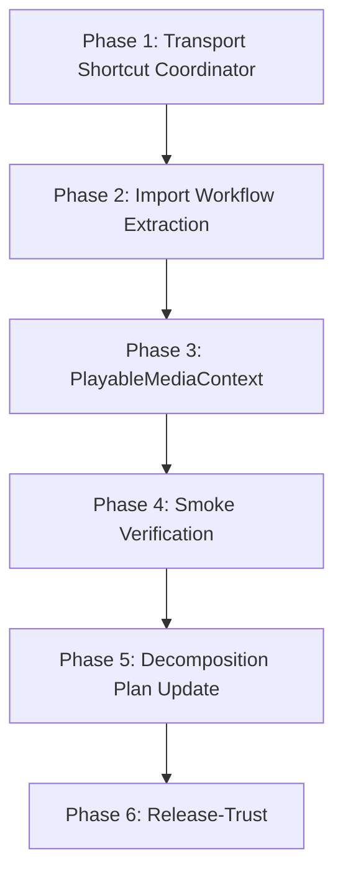

# Transport Coherence Wave 4 — Shell Decomposition and Proof Hardening Plan

**Status:** Complete  
**Last Updated:** 2026-03-16  
**Related:** Transport Coherence Wave 3, MAINWINDOW_DECOMPOSITION_PLAN.md, TRANSPORT_PANEL_PUBLISHERS.md

## Executive Summary

Transport Coherence Wave 3 delivered: shell event cleanup, StatusBarCoordinator extraction, TransportContextChanged event, toolbar/keyboard coherence via PlaybackOperationsHandler→orchestrator. The mentor verified: **mostly real, not bulletproof yet.**

**Remaining weaknesses:**
1. Keyboard shortcut summary overstated — MainWindow still registers `playback.play` (Space), `playback.stop` (S) via `RegisterKeyboardShortcuts`; not "removed"
2. MainWindow.xaml.cs still ~108 KB — too large
3. Import flow (`ImportAudioFile`) is a giant workflow in the shell
4. Transport context is three loose fields; not a rich model
5. Two key UX proofs (import→main Play, select→main Play) need explicit automation and CI verification

---

## Phase 1: Keyboard/Transport Shortcut Orchestration Extraction

**Goal:** Remove shell ownership of playback shortcut registration. One place owns transport shortcut semantics.

### Task 1.1 — Create TransportShortcutCoordinator

**New file:** `src/VoiceStudio.App/Services/TransportShortcutCoordinator.cs`

**Responsibilities:**
- Register `playback.play` (Space), `playback.stop` (S), `playback.record` (Ctrl+R) with `KeyboardShortcutService`
- Delegate to `IGlobalTransportOrchestrator` when available (same as PlaybackOperationsHandler)
- `Attach(KeyboardShortcutService, IGlobalTransportOrchestrator?)` — called from MainWindow Loaded
- `Detach()` — unregister shortcuts; called from MainWindow Cleanup

**Design (strict):**
- **Play/Stop:** Go through `IGlobalTransportOrchestrator` only. Coordinator resolves orchestrator from DI; invokes `orchestrator.TogglePlaybackAsync()` and `orchestrator.StopPlayback()`. No shell callback for play/stop — if the transport architecture is real, the orchestrator owns it.
- **Record:** May use a separate callback or `IRecordingCoordinator` until recording transport is unified. Recording is not yet part of global transport; explicit callback is acceptable.
- Coordinator holds references to `KeyboardShortcutService` and `IGlobalTransportOrchestrator`; for record, may receive `Func<Task> toggleRecord` until recording is integrated.

**Reference:** MainWindow.xaml.cs lines 1109–1149 (`RegisterKeyboardShortcuts` playback block)

### Task 1.2 — Migrate MainWindow to Use Coordinator

**File:** `src/VoiceStudio.App/MainWindow.xaml.cs`

**Actions:**
1. Add `TransportShortcutCoordinator? _transportShortcutCoordinator` field
2. In Loaded: `_transportShortcutCoordinator = AppServices.GetService<TransportShortcutCoordinator>(); _transportShortcutCoordinator?.Attach(_keyboardShortcutService, orchestrator, toggleRecord: () => ToggleRecording());` — play/stop via orchestrator only; record via callback until unified
3. Remove `playback.play`, `playback.stop`, `playback.record` (and optionally `file.import`) from `RegisterKeyboardShortcuts` — keep file/edit shortcuts in MainWindow for now, or move them too
4. In Cleanup: `_transportShortcutCoordinator?.Detach(); _transportShortcutCoordinator = null;`

**Pass criteria:** Space/S/Ctrl+R still trigger global transport; MainWindow no longer owns playback shortcut registration.

---

## Phase 2: Import Workflow Extraction

**Goal:** Shell triggers import; service owns the workflow.

### Task 2.1 — Create IImportWorkflowService and Implementation

**New file:** `src/VoiceStudio.Core/Services/IImportWorkflowService.cs` (interface)

```csharp
public interface IImportWorkflowService
{
    Task<bool> ImportAudioFileAsync(IntPtr parentWindowHandle, CancellationToken ct = default);
}
```

**New file:** `src/VoiceStudio.App/Services/ImportWorkflowService.cs`

**Responsibilities:**
- File picker (WinRT FileOpenPicker; fallback to NativeFileDialog on COM failure)
- Backend upload via `IBackendClient.UploadAudioFileAsync` (intermediate transport seam — acceptable for this wave)
- Publish `AssetAddedEvent`
- Call `IContextManager.SetCurrentPlayable`, `SetActiveAsset`
- Toast notifications (success, warning, error)

**Constraint:** `ImportWorkflowService` is allowed to use the current upload seam as an intermediate step, but must not create a new long-lived shell-level dependency pattern that bypasses the domain direction of the app. Prefer a more specific seam (e.g. `ILibraryClient.UploadLibraryAssetAsync`) if one exists or can be added cheaply.

**Reference:** MainWindow.xaml.cs lines 1849–1972 (`ImportAudioFile`)

### Task 2.2 — Wire MainWindow to ImportWorkflowService

**File:** `src/VoiceStudio.App/MainWindow.xaml.cs`

**Actions:**
1. Replace `ImportAudioFile()` body with: `var service = AppServices.GetService<IImportWorkflowService>(); _ = service?.ImportAudioFileAsync(hwnd);`
2. `ImportAudioFile` becomes a thin wrapper that gets `hwnd` and calls the service
3. Register `ImportWorkflowService` in DI: `services.AddSingleton<IImportWorkflowService, ImportWorkflowService>()`

**Callers to update:** LibraryView.xaml.cs line 51, CustomizableToolbar.xaml.cs lines 400–404, MainWindow.Menu.cs line 47 — all call `MainWindow.ImportAudioFile()`; they can call `IImportWorkflowService.ImportAudioFileAsync` via a method that resolves `parentWindowHandle` from the current window, or MainWindow keeps a thin `ImportAudioFile()` that delegates

**Pass criteria:** Import flow works; MainWindow no longer contains picker/upload/event/toast logic.

---

## Phase 3: Strengthen Transport Context Model (DEFERRED)

**Goal:** Replace three loose fields with a rich `PlayableMediaContext` model.

**Deferral rule:** Do not do Phase 3 until Phase 1 and Phase 2 are clean. PlayableMediaContext is additive complexity, touches shared contracts, and risks spreading a model change across too many files. It is not the shortest path to better user experience. The real leverage is: get keyboard transport out of MainWindow, get import workflow out of MainWindow, prove the exact UX path works.

### Task 3.1 — Define PlayableMediaContext

**New file:** `src/VoiceStudio.Core/Models/PlayableMediaContext.cs`

```csharp
public sealed class PlayableMediaContext
{
    public string? MediaId { get; }
    public TransportSource? Source { get; }
    public string? Title { get; }
    public string? MediaType { get; }       // "audio", "video", etc.
    public TimeSpan? Duration { get; }     // if known
    public string? UnavailableReason { get; }  // e.g. "Backend offline"
    public string? OriginPanelId { get; }   // optional panel that owns this
}
```

### Task 3.2 — Extend IContextManager with PlayableMediaContext

**File:** `src/VoiceStudio.Core/Services/IContextManager.cs`

**Actions:**
1. Add `PlayableMediaContext? CurrentPlayableContext { get; }` — computed from `CurrentPlayableAudioId`, `CurrentPlayableSource`, `CurrentPlayableTitle` (or stored)
2. Add `SetCurrentPlayable(string? audioId, TransportSource? source, string? title, string? mediaType = null, TimeSpan? duration = null)` — overload or extend
3. `TransportContextChangedEventArgs` can carry `PlayableMediaContext` instead of/in addition to raw fields

**Pass criteria:** Listeners can reason about media type, duration, unavailable reason; backward compat preserved.

---

## Phase 4: Automate Two Key UX Proofs

**Goal:** Import→main Play and select→main Play are explicitly proven by smoke execution, not by documentation alone.

### Task 4.1 — Prove Smoke Execution, Not Documentation

**Verification path (explicit):**
- **Import → main Play:** Verified by `MainWindow.Smoke.cs` → `RunLibraryImportAndPlaybackAsync` (lines 780–920). Exercised via `.\scripts\verify.ps1` Stage 8.5 (UI Self-Test): app launched with `--ui-self-test` runs `RunGateCUiSmokeNavigationAsync`, which invokes the `LibraryImportPlayback` step.
- **Select existing asset → main Play:** Verified by `MainWindow.Smoke.cs` → `RunLibraryPlaybackAsync` (lines 643–771). Same path: Stage 8.5 `--ui-self-test` invokes the `LibraryPlayback` step.

**Actions:**
1. Confirm these two smoke paths are actually executed by the verification stage you run (trace `verify.ps1` Stage 8 and `smoke.ps1` to the exact test methods).
2. If they are not executed: either wire them into the verification path, or mark them **manual-only** and do not count them as automated proof.
3. Document the exact verification command and pass condition: "`.\scripts\verify.ps1` Stage 8.5 (UI Self-Test) launches app with `--ui-self-test`; `RunGateCUiSmokeNavigationAsync` runs `LibraryImportPlayback` and `LibraryPlayback` steps; both must pass (exit code 0)."

**Pass criteria:** Both workflows are definitely executed by the smoke path you actually run in verification; or explicitly marked manual-only and not counted as automated proof. No "doc comments say this proves it" — execution evidence required.

### Task 4.2 — Add Optional Focused Smoke for Keyboard Transport

**Action:** Add a smoke step or manual test: "Select Library asset, press Space (without focusing Timeline), playback starts via global transport." This proves keyboard Space uses same rules as transport strip.

**Pass criteria:** No split-brain between keyboard and mouse; documented or automated.

---

## Phase 5: MainWindow Decomposition Plan Update

**Goal:** Update the decomposition plan to reflect Status Bar done and next slice.

### Task 5.1 — Update MAINWINDOW_DECOMPOSITION_PLAN.md

**File:** `docs/design/MAINWINDOW_DECOMPOSITION_PLAN.md`

**Actions:**
1. Mark "Status Bar Orchestration" as **Done** (StatusBarCoordinator extracted)
2. Add "Transport Shortcut Orchestration" as **Next slice** (or "Import Workflow" if preferred)
3. Add "Import Workflow" to Future Slices with updated priority
4. Update line counts if available

**Pass criteria:** Plan reflects current state.

---

## Phase 6: Release-Trust Parallel

**Goal:** Product UX work does not cause release-trust drift.

### Task 6.1 — Keep Verify Path and Caveats Documented

**Actions:**
1. Do not mark release-trust complete or transition to v1.2 solely due to transport work
2. Ensure STATE.md Next Steps reflect transport wave 4 completion and remaining release-trust items
3. Document testhost caveat if applicable

**Pass criteria:** Release-trust remains parallel; no fake transition.

---

## Execution Order



**Recommended order:** 1 → 2 → 4 → 5 → 6 → 3 (Phase 3 only if still needed after the above). Do not do Phase 3 early.

---

## Wave Success Criteria (Hard Gates)

Before claiming this wave is complete, all of the following must hold:

| Criterion | Verification |
|-----------|--------------|
| MainWindow no longer registers playback shortcuts | `rg "playback\.play|playback\.stop" MainWindow.xaml.cs` → 0 matches in RegisterKeyboardShortcuts |
| MainWindow.ImportAudioFile() is a thin wrapper only | `ImportAudioFile` body < 15 lines; delegates to IImportWorkflowService |
| Import → main Play is proven by smoke | Smoke path executes and passes; not doc-only |
| Select existing asset → main Play is proven by smoke | Smoke path executes and passes; not doc-only |
| Release-trust notes remain intact | STATE.md Next Steps and caveats unchanged or updated correctly |
| MainWindow.xaml.cs shrinks measurably | Line count reduced by ≥100 lines (or equivalent responsibility count) |

If Cursor claims this wave is complete, the first checks are: does MainWindow still register transport shortcuts? Does ImportAudioFile still contain the real workflow? Are the two UX proofs actually exercised by verification?

---

## Key Files

| Purpose | File |
|---------|------|
| Transport shortcuts | MainWindow.xaml.cs `RegisterKeyboardShortcuts` (lines 1109–1149) |
| Import flow | MainWindow.xaml.cs `ImportAudioFile` (lines 1849–1972) |
| Smoke tests | MainWindow.Smoke.cs `RunLibraryImportAndPlaybackAsync`, `RunLibraryPlaybackAsync` |
| Decomposition plan | MAINWINDOW_DECOMPOSITION_PLAN.md |

---

## Risks

1. **Task 1**: TransportShortcutCoordinator must not create circular dependency; use callback or Func from MainWindow.
2. **Task 2**: ImportWorkflowService needs `parentWindowHandle` for picker; MainWindow must pass it or service must resolve from current window.
3. **Task 3**: PlayableMediaContext is additive; ensure no breaking changes to existing `SetCurrentPlayable` callers.

---

## Ruthless Summary

**Weak idea:** "Transport is done, so we can stop."

**Strong idea:** Transport is a hardening wave, not a finish line. MainWindow is still too large. Extract keyboard shortcuts and import workflow, prove the two workflows by smoke execution (not documentation), and keep release-trust parallel. Phase 3 (PlayableMediaContext) stays deferred until Phase 1–2 are clean.

---

## Changelog

- 2026-03-16: Wave complete. Phase 1 (TransportShortcutCoordinator), Phase 2 (ImportWorkflowService), Phase 4 (smoke via verify.ps1 Stage 8.5), Phase 5 (MAINWINDOW_DECOMPOSITION_PLAN updated) done. Phase 3 (PlayableMediaContext) deferred. All Wave Success Criteria met.
- 2026-03-16: Mentor tightening: Phase 1 play/stop via orchestrator only (no shell callback); Phase 2 constraint on long-lived shell dependency; Phase 3 deferred forcefully; Phase 4 requires execution evidence not doc comments; added Wave Success Criteria (hard gates).
- 2026-03-16: Initial plan; mentor feedback on Wave 3; next tasks: Transport Shortcut Coordinator, Import Workflow, PlayableMediaContext, smoke automation, decomposition plan update.
