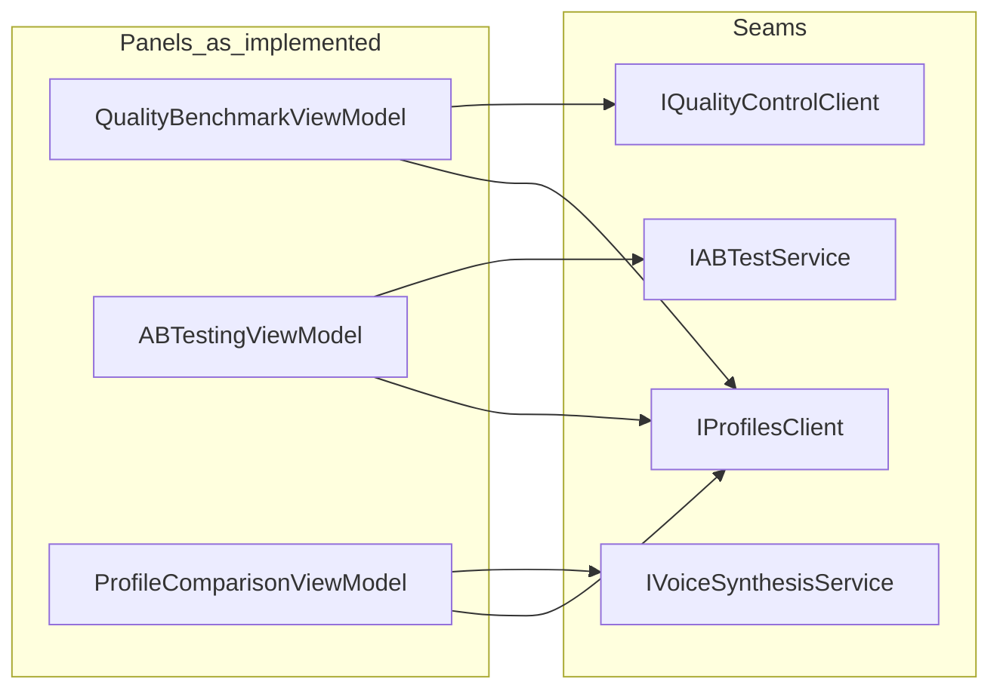

# Workflow Coherence Pass 08 — Quality / Benchmark / Profile Comparison

**Purpose:** Bounded **planning-first** pass for the **quality evaluation cluster**: **Quality Benchmark**, **A/B Testing**, and **Profile Comparison** — map **code-truth** workflows, defects, and a **single** bounded implementation row (**W8-C1**) without claiming closure-grade product workflow until **§8** is signed.

**Date:** 2026-03-24  
**Status:** **W8-C1 closed** (2026-03-25) — **§8.2** signed; operational Quality Benchmark UI + **8** seam tests + historical Quick **`artifacts/verify/20260325_191036`** (**`commit_hash`** **`bcd6d4e52e0b2a7763f0baaa261e7cdac7f8a665`** — W8-C1 product closure). **W8-C3 closed** (2026-03-26) — §8.7; Quick **`artifacts/verify/20260326_025824`**, **`commit_hash`** **`eb98604039b390f676c98fdb805957a46cd9429c`**. **W8-C2:** **closed** (2026-03-26) — operational **`ABTestingView`** + **`ABTestingViewModelSeamTests`** **8** — proof **§8.10** + **`latest_pointer.json`** after **post–W8-C2-commit** `verify.ps1 -Quick` (Pass 08 **§8.9** sign-off **not** Product Trust §8.9). **Hermetic hardening** milestone remains **`20260326_020644`** / **`8ba6363f`** (compile baseline; does **not** rerun QB/C3/C2 seams). Export/context remain **OUT**. **§1–§7** baseline complete. **Workflow 7** remains **paused after W7-C1** ([Pass 07 §8.4](WORKFLOW_COHERENCE_PASS_07_TRAINING_DATASET_MODEL_PROFILE.md#84-workflow-7--continuation--pause-governance)). **[Product trust Pass 01](PRODUCT_TRUST_AND_RELEASE_HONESTY_PASS_01.md)** remains **paused** (Pass 01 §8.9 Option 1). **P05-Persist-A4** remains **§12-gated**. **Pass 06** further `src/` requires a **new §5** row.

**Related:** [CROSS_FEATURE_WORKFLOW_BACKLOG.md](CROSS_FEATURE_WORKFLOW_BACKLOG.md) (Workflow 8), [Pass 07](WORKFLOW_COHERENCE_PASS_07_TRAINING_DATASET_MODEL_PROFILE.md) (adjacent lane discipline).

---

## 1. Purpose and scope

### 1.1 In scope (this pass)

- **Code-truth** map of the **as-is** cluster: three panels (benchmark, A/B, profile comparison), clients, load vs run paths, and **View ↔ ViewModel** alignment.
- **Defect / coherence** inventory with stable IDs (**W8-D***) tied to files and seams.
- **Bounded change matrix** with **one** proposed first row (**W8-C1**); additional rows **TBD** and require a **new §5** line + **§8** sign-off.
- **Strict OUT** list and **proof expectations** before any implementation.

### 1.2 Out of scope (unless a future signed row explicitly adds them)

- **Training** cluster, **engine** subprocess / manifest / algorithm changes.
- **Product Trust** honesty **execution** slices (lane **paused** — no new footnote-only sweeps inside Pass 08 by default).
- **Pass 05 A4** (drag-drop → project parity); **Pass 06** backup/restore behavior.
- Broad **IQualityControlClient** surface rework (31 API methods) or backend **quality** route redesign.
- **Simultaneous** full UI build-out for **all three** panels in one slice — **W8-C1** is **Quality Benchmark–centric** only unless §5 is expanded.

---

## 2. Code-truth owner map

Paths relative to repo root. Inventory from **2026-03-24** read.

| Owner | Path | Role |
|-------|------|------|
| **Quality Benchmark VM** | [src/VoiceStudio.App/Views/Panels/QualityBenchmarkViewModel.cs](../../src/VoiceStudio.App/Views/Panels/QualityBenchmarkViewModel.cs) | `IQualityControlClient`, `IProfilesClient`; `InitializeAsync` → `LoadProfilesAsync` (`GetProfilesAsync`); `RunBenchmarkCommand` → `RunBenchmarkAsync` → populates `BenchmarkResults` / `BenchmarkResultViewModel`; `SurfaceMaturityFootnote` (Product Trust slice 4); `ResultsSummary` from resource `QualityBenchmark.BenchmarkComplete` |
| **Quality Benchmark view** | [src/VoiceStudio.App/Views/Panels/QualityBenchmarkView.xaml](../../src/VoiceStudio.App/Views/Panels/QualityBenchmarkView.xaml), [.xaml.cs](../../src/VoiceStudio.App/Views/Panels/QualityBenchmarkView.xaml.cs) | **XAML:** header + **`SurfaceMaturityFootnote`** + collapsed `HelpOverlay` only — **no** operational bindings to VM. **Code-behind:** `Loaded` → `InitializeAsync`; toast on `ErrorMessage`; **subscribes to `StatusMessage`** (VM has **no** such property — see §4); `BenchmarkResult_RightTapped` / export expect **ListView** not present in XAML |
| **A/B Testing VM** | [src/VoiceStudio.App/Views/Panels/ABTestingViewModel.cs](../../src/VoiceStudio.App/Views/Panels/ABTestingViewModel.cs) | `IABTestService`, `IProfilesClient`, `IAudioPlayerService`; **`InitializeAsync`** → `LoadProfilesAsync` ( **W8-C2** / **§8.8** ); `RunTestCommand` → `RunABTestAsync` → `TestResults`; **`StatusMessage`** on success; `PlaySampleA/B` via `GetAudioStreamAsync` + `PlayStreamAsync` |
| **A/B Testing view** | [src/VoiceStudio.App/Views/Panels/ABTestingView.xaml](../../src/VoiceStudio.App/Views/Panels/ABTestingView.xaml), [.xaml.cs](../../src/VoiceStudio.App/Views/Panels/ABTestingView.xaml.cs) | **W8-C2:** operational **`x:Bind`** shell + **`Loaded`** → `InitializeAsync`. **Code-behind:** toasts on **`ErrorMessage`** / **`StatusMessage`** |
| **Profile Comparison VM** | [src/VoiceStudio.App/ViewModels/ProfileComparisonViewModel.cs](../../src/VoiceStudio.App/ViewModels/ProfileComparisonViewModel.cs) | `IVoiceSynthesisService`, `IProfilesClient`, `IAudioPlayerService`; `InitializeAsync` → `LoadProfilesAsync`; `CompareProfilesAsync` — **hard-coded** `Engine = "xtts"` for both requests; success **toast** on compare; auto `CompareProfilesAsync` on A/B selection change (fire-and-forget with `CancellationToken.None`) |
| **Profile Comparison view** | [src/VoiceStudio.App/Views/Panels/ProfileComparisonView.xaml](../../src/VoiceStudio.App/Views/Panels/ProfileComparisonView.xaml), [.xaml.cs](../../src/VoiceStudio.App/Views/Panels/ProfileComparisonView.xaml.cs) | **XAML:** **HelpOverlay-only** grid — **no** profile pickers or compare UI. **Code-behind:** `Loaded` → `InitializeAsync`; error toast only |
| **Quality HTTP contract** | [src/VoiceStudio.App/Core/Services/IQualityControlClient.cs](../../src/VoiceStudio.App/Core/Services/IQualityControlClient.cs) | Includes `RunBenchmarkAsync(BenchmarkRequest)` plus broader quality APIs (dashboard, analysis, etc.) — **Pass 08** does **not** inventory every consumer |
| **A/B service** | [src/VoiceStudio.App/Services/IABTestService.cs](../../src/VoiceStudio.App/Services/IABTestService.cs), [ABTestService.cs](../../src/VoiceStudio.App/Services/ABTestService.cs) | Registered in [AppServices](../../src/VoiceStudio.App/Services/AppServices.cs) |
| **Panel registration** | [CorePanelRegistrationService.cs](../../src/VoiceStudio.App/Services/CorePanelRegistrationService.cs) (`QualityBenchmark`); [ModulePanelRegistrationService.cs](../../src/VoiceStudio.App/Services/ModulePanelRegistrationService.cs) (`ABTesting`, `ProfileComparison`) | Discovery / menu — **not** proof of shippable UI |

**Existing seam tests (Product Trust slice 4):** [QualityBenchmarkViewModelSeamTests.cs](../../src/VoiceStudio.App.Tests/ViewModels/QualityBenchmarkViewModelSeamTests.cs) — footnote / maturity disclosure; **not** proof of end-to-end benchmark UI workflow.

---

## 3. As-is workflow map (code-truth)

### 3.1 Quality Benchmark

1. **Shell load:** `QualityBenchmarkView` ctor builds `QualityBenchmarkViewModel`, sets `DataContext`. **`Loaded`** (ADR-047) calls `InitializeAsync` → **`LoadProfilesAsync`** → `IProfilesClient.GetProfilesAsync` → fills `Profiles` collection.
2. **Run (VM only):** User would need UI bound to `RunBenchmarkCommand` — **missing in XAML** (§4). If invoked: builds `BenchmarkRequest` (`ProfileId`, `TestText`, `Language`, `Engines` from xtts/chatterbox/tortoise toggles, `EnhanceQuality`) → **`IQualityControlClient.RunBenchmarkAsync`** → clears/adds **`BenchmarkResults`**; raises `HasResults` / `ResultsSummary`.
3. **User-visible outcome today:** **Footnote** always visible in XAML; **results** and **summary** not bound — user cannot complete the loop from the committed view.

### 3.2 A/B Testing

1. **Shell load (W8-C2):** `ABTestingView` **`Loaded`** (ADR-047) calls **`InitializeAsync`** → **`LoadProfilesAsync`** → **`IProfilesClient.GetProfilesAsync`** → fills `Profiles`.
2. **Run:** `RunTestAsync` → **`IABTestService.RunABTestAsync`** with `EngineA`/`EngineB`, emotions, enhancement flags → **`TestResults`**; sets **`StatusMessage`** on success; updates metrics display properties.
3. **Play:** `PlaySampleA` / `PlaySampleB` (**async void**) fetch stream via **`GetAudioStreamAsync(Sample.AudioId)`** + **`PlayStreamAsync`**.
4. **View:** Operational controls bound to VM (**profile**, **test text**, engines, run, results, play when URLs exist).

### 3.3 Profile Comparison

1. **Shell load:** `ProfileComparisonView` **`Loaded`** → **`InitializeAsync`** → **`LoadProfilesAsync`** → fills `AvailableProfiles`.
2. **Compare:** **`CompareProfilesAsync`** — two **`VoiceSynthesisRequest`** with **`Engine = "xtts"`** — **`IVoiceSynthesisService.SynthesizeVoiceAsync`** for A and B → sets **`AudioUrlA/B`**, **`ComparisonData`**, success toast.
3. **Selection-changed auto-compare:** **`OnSelectedProfileAChanged` / `OnSelectedProfileBChanged`** fire **`CompareProfilesAsync(CancellationToken.None)`** when both set — **fire-and-forget** (no panel **`Loaded`** guard in those paths beyond VM ctor).
4. **View:** No XAML for dropdowns / compare button — workflow **not** reachable from current XAML.

### 3.4 Cross-surface summary

| Question | Code-truth answer |
|----------|-------------------|
| Shared **profile** selection with **`IContextManager`** / **Profiles** panel? | **No** — each VM owns local `SelectedProfile` / `SelectedProfileA-B`; no event wiring in these files to global context. |
| **Activation** refresh when profiles change elsewhere? | **Not** in this cluster — reload on own `InitializeAsync` or ctor only; no **`ProfileCreatedEvent`** subscribers here. |
| **Consistent** engine semantics across benchmark vs A/B vs comparison? | **No** — Benchmark uses multi-engine list; A/B uses configurable A/B engines; Comparison **fixed** `xtts` only. |
| **After success**, is there a coherent **next step**? | **Profile Comparison** — success toast. **Quality Benchmark** VM — **`ResultsSummary`** string only, **no** toast in VM; view listens for nonexistent **`StatusMessage`**. |

---

## 4. Defects / coherence gaps (initial inventory)

**Rule:** Each row must be **anchored** to observable code behavior; priorities revised after §8.

| ID | Symptom | Owner / seam | Stop-short / code anchor | Priority |
|----|---------|--------------|---------------------------|----------|
| **W8-D001** | **Quality Benchmark** panel shows **footnote only** — no profile picker, run control, or results list in XAML | [QualityBenchmarkView.xaml](../../src/VoiceStudio.App/Views/Panels/QualityBenchmarkView.xaml) vs [QualityBenchmarkViewModel.cs](../../src/VoiceStudio.App/Views/Panels/QualityBenchmarkViewModel.cs) | VM fully implements pipeline; **view does not surface it** — workflow **incomplete** for end users | **High** |
| **W8-D002** | Success toast path in **QualityBenchmarkView** never fires for **`StatusMessage`** | [QualityBenchmarkView.xaml.cs](../../src/VoiceStudio.App/Views/Panels/QualityBenchmarkView.xaml.cs) | `PropertyChanged` listens for **`StatusMessage`** — property **absent** on `QualityBenchmarkViewModel` | **Med** |
| **W8-D003** | **Export** / context-menu code expects **ListView** + **`BenchmarkResultViewModel`** shape; XAML has **no** list; export reflection uses **`MosScore`** etc. — **BenchmarkResultViewModel** exposes **`MosScoreDisplay`** / dict-backed metrics, **not** flat `MosScore` | [QualityBenchmarkView.xaml.cs](../../src/VoiceStudio.App/Views/Panels/QualityBenchmarkView.xaml.cs), [QualityBenchmarkViewModel.cs](../../src/VoiceStudio.App/Views/Panels/QualityBenchmarkViewModel.cs) (`BenchmarkResultViewModel`) | **Dead / inconsistent** UX path even if UI were added without fixing export | **Med** |
| **W8-D004** | **A/B Testing** panel is **placeholder** — no VM bindings | [ABTestingView.xaml](../../src/VoiceStudio.App/Views/Panels/ABTestingView.xaml) vs [ABTestingViewModel.cs](../../src/VoiceStudio.App/Views/Panels/ABTestingViewModel.cs) | Users see marketing copy only; **cannot** run A/B test from UI | **High** |
| **W8-D005** | Success toast for **`StatusMessage`** on **A/B** — property **missing** on VM | [ABTestingView.xaml.cs](../../src/VoiceStudio.App/Views/Panels/ABTestingView.xaml.cs) | Same pattern as W8-D002 | **Low** |
| **W8-D006** | **Profile Comparison** view is **HelpOverlay-only** — no compare UI | [ProfileComparisonView.xaml](../../src/VoiceStudio.App/Views/Panels/ProfileComparisonView.xaml) vs [ProfileComparisonViewModel.cs](../../src/VoiceStudio.App/ViewModels/ProfileComparisonViewModel.cs) | VM + synthesis path exist; **not exposed** in XAML | **High** |
| **W8-D007** | **Inconsistent profile-load lifecycle** — A/B uses **ctor** fire-and-forget; others use **`Loaded` + InitializeAsync** | [ABTestingViewModel.cs](../../src/VoiceStudio.App/Views/Panels/ABTestingViewModel.cs) vs Quality / Profile Comparison | Staleness / ordering harder to reason about; tests may see races | **Med** |
| **W8-D008** | **Profile Comparison** always uses **`Engine = "xtts"`** for both profiles — not aligned with user-chosen engines elsewhere | `CompareProfilesAsync` in [ProfileComparisonViewModel.cs](../../src/VoiceStudio.App/ViewModels/ProfileComparisonViewModel.cs) | “Comparison” across panels is **not apples-to-apples** | **Med** |
| **W8-D009** | **No** integration with **global** profile context — isolated **`SelectedProfile`** per panel | Cluster VMs | User may have **Profiles** panel selection **≠** benchmark selection | **Med** |
| **W8-D010** | After benchmark, **no** structured **next-step** affordance (toast, link copy, or navigation hint) in VM — only **`ResultsSummary`** string | `RunBenchmarkAsync` / `ResultsSummary` in [QualityBenchmarkViewModel.cs](../../src/VoiceStudio.App/Views/Panels/QualityBenchmarkViewModel.cs) | Coherence stop-short: user finishes action, **low guidance** vs **ProfileComparison** success toast | **High** (targets **W8-C1** theme) |

---

## 5. Bounded change matrix

Only **one** row may be **in progress** in implementation at a time. All rows require **§8** sign-off before `src/`.

| Row ID | Hypothesis | Primary owner | Supporting owner (exactly one path) | Initial tests / proof |
|--------|------------|---------------|-------------------------------------|------------------------|
| **W8-C1** (frozen §8.1) | Operational UI + results + next-step guidance; **export/context-menu OUT** — **§8.1** table. | [QualityBenchmarkViewModel.cs](../../src/VoiceStudio.App/Views/Panels/QualityBenchmarkViewModel.cs) | [QualityBenchmarkView.xaml](../../src/VoiceStudio.App/Views/Panels/QualityBenchmarkView.xaml); [.xaml.cs](../../src/VoiceStudio.App/Views/Panels/QualityBenchmarkView.xaml.cs) — strip dead export/context handlers | **FQN** `VoiceStudio.App.Tests.ViewModels.QualityBenchmarkViewModelSeamTests`; **8** passed after closure (5+3); **§8.1** |
| **W8-C2** (**§8.8** freeze; **`src/`** after **§8.9**) | A/B Testing **operational UI**: profile + test text + engine A/B + emotion + enhancement + **Run** + results metrics + play A/B; **lifecycle:** `InitializeAsync` + **`Loaded`** (no ctor profile load). | [`ABTestingViewModel.cs`](../../src/VoiceStudio.App/Views/Panels/ABTestingViewModel.cs) | [`ABTestingView.xaml`](../../src/VoiceStudio.App/Views/Panels/ABTestingView.xaml); [`ABTestingView.xaml.cs`](../../src/VoiceStudio.App/Views/Panels/ABTestingView.xaml.cs) | **FQN** `ABTestingViewModelSeamTests`; **0→8**; proof **§8.10** |
| **W8-C3** (**closed** 2026-03-26 — **§8.6** + **§8.7**) | Operational shell: profile **A** / **B** selectors, **preview text**, **explicit Compare** control, **engine policy** (`ComparisonEngineId` + combo; no buried literals-only path), **comparison result surface**; **playback** via `PlayProfileA/B`. | [ProfileComparisonViewModel.cs](../../src/VoiceStudio.App/ViewModels/ProfileComparisonViewModel.cs) | [ProfileComparisonView.xaml](../../src/VoiceStudio.App/Views/Panels/ProfileComparisonView.xaml); [.xaml.cs](../../src/VoiceStudio.App/Views/Panels/ProfileComparisonView.xaml.cs) | **FQN** `ProfileComparisonViewModelSeamTests`; **8** passed; proof **§8.7** |

**W8-C1 rationale:** **Footnote + VM** already exist; the largest **user-visible** gap is **missing operational shell** (W8-D001) plus **post-run guidance** (W8-D010). Fixing all three panels at once violates **narrow lane** discipline.

---

## 6. Strict OUT list (Pass 08 — default)

Until **§8** expands scope:

- **OUT:** **Any** `src/` change **without** **§8.2** sign-off authorizing **W8-C1** — **§8.1** is a **technical freeze** only, **not** implementation approval.
- **OUT:** **Training** cluster, **model training** UI/backend, **`IModelManagerClient`** training paths.
- **OUT:** **Synthesis engine** algorithm changes, **engine manifests**, **`app/core/engines`**.
- **OUT:** **Pass 05 A4**; **Pass 06** `backup.py` / restore semantics / new slice without Pass 06 §5.
- **OUT:** **Product Trust** honesty **execution** (new footnote sweeps) **inside** this pass — lane **paused**.
- **OUT:** **Broad** benchmark algorithm / **IQualityControlClient** API redesign.
- **OUT:** **Multi-panel** “fix everything quality” — **W8-C1** is **Quality Benchmark + one** supporting view layer only.
- **OUT (W8-C1 slice):** **Export**, **context menu**, **right-tap** on benchmark results — see **§8.1**; remove dead code if editing code-behind, do **not** implement those features in W8-C1.
- **OUT:** **Generic** panel cleanup unrelated to **W8-C1** file lock.
- **OUT:** Combining **W8-C1** with **W7-C2** or reopening **Workflow 7** without Pass 07 **§8.4** procedure.

---

## 7. Proof expectations (implementation phase)

When **§8** authorizes **W8-C1**:

1. **Build:** `dotnet build VoiceStudio.sln -c Debug -p:Platform=x64` — zero errors in changed scope.
2. **Seam / unit:** `dotnet test src/VoiceStudio.App.Tests/VoiceStudio.App.Tests.csproj -c Debug -p:Platform=x64 --filter "FullyQualifiedName~VoiceStudio.App.Tests.ViewModels.QualityBenchmarkViewModelSeamTests"` — **expect 8 passed** (§8.1); full **class FQN** only (no lazy substring).
3. **Verify:** `.\scripts\verify.ps1 -Quick` → new `artifacts/verify/<timestamp>`; **`artifacts/verify/latest_pointer.json`** updated.
4. **Rule:** **Quick verify does not subsume** targeted seam proof.

**Planning phase:** Updating **`latest_pointer`** for **documentation-only** commits is **optional** and **must not** be treated as **W8-C1** closure.

---

## 8. Sign-off and execution record

### 8.0 W8-C1 entry and exit criteria

**Entry criteria (before `src/`):**

- §1–§7 baseline accepted as repo-truth for the quality cluster.
- **§8.1** technical row read and accepted: **file lock**, **seam FQN**, **expected test count** (**8**), **IN/OUT** including **export/context-menu OUT**.
- **§8.2** signed (name + date) — this doc alone does **not** authorize code.

**Exit criteria (closure of W8-C1):**

- Target behavior in **§8.1 IN** is implemented within **file lock** only.
- `dotnet test` filter `FullyQualifiedName~VoiceStudio.App.Tests.ViewModels.QualityBenchmarkViewModelSeamTests` reports **exactly 8** passed (no skips).
- `dotnet build VoiceStudio.sln -c Debug -p:Platform=x64` succeeds.
- `.\scripts\verify.ps1 -Quick` → new PASSED artifact; **`artifacts/verify/latest_pointer.json`** advanced.
- **Quick verify does not subsume** seam proof (cite both in **§8.3** and STATE **Last Verified Commands**).
- Update **Pass 08 §8.3**, [.cursor/STATE.md](../../.cursor/STATE.md) ACTIVE WINDOW / PROOF INDEX, [backlog](CROSS_FEATURE_WORKFLOW_BACKLOG.md) Workflow 8 row, [CANONICAL_REGISTRY.md](../governance/CANONICAL_REGISTRY.md) if banner needs W8-C1 closure line.
- **Leftovers:** explicitly list any **W8-D** items **not** addressed (e.g. A/B placeholder UI → **W8-C2**; Profile Comparison shell → **W8-C3**).

| Milestone | Status | Notes |
|-----------|--------|-------|
| Planning doc §1–§7 accepted | **Complete** (baseline) | Repo-truth audit captured |
| **W8-C1** row frozen in §8.1 | **Complete** (technical freeze) | **§8.2** signed **2026-03-25** (Tyler) — `src/` authorized |
| Implementation **W8-C1** | **Complete** | File lock only; operational VM/view + `QualityBenchmark.W8C1.*` resources |
| Closure **W8-C1** | **Complete** | Proof triple §7: build; seam **8** passed; Quick **`20260325_191036`**; `latest_pointer.json` → **`20260325_191036`**, **`commit_hash`** **`bcd6d4e52e0b2a7763f0baaa261e7cdac7f8a665`** |

### 8.1 Execution row W8-C1 — technical freeze (implementation **not** authorized until §8.2)

This block is the **execution-grade** contract. **§8.2** is the **authorization** gate.

| | |
|--|--|
| **Target behavior (IN)** | End user can: pick **profile**, edit **test text**, toggle **engines** (xtts/chatterbox/tortoise), **run** benchmark, see **loading/error** state, see **per-engine results** (from `BenchmarkResults` / `BenchmarkResultViewModel`) and **results summary**. After a **successful** run, user sees **resource-backed next-step guidance** (new or existing `QualityBenchmark.*` string on VM, or dedicated property bound in XAML — must be **unit-testable** in seam class). **Success notification:** VM must expose an observable contract **consistent** with code-behind (either implement **`StatusMessage`** on `QualityBenchmarkViewModel` **or** remove the dead `StatusMessage` listener in code-behind and drive success via a **documented** VM property — **same file lock**). |
| **Explicit OUT (W8-C1)** | **Right-tap context menu**, **ExportBenchmarkResultAsync**, **`BenchmarkResult_RightTapped`**, and any **ListView** behavior tied only to export — **not in scope**; if results **ListView** is added for **display**, it must **not** advertise export/context actions in this slice. **Remove** dead export/context-menu code from [QualityBenchmarkView.xaml.cs](../../src/VoiceStudio.App/Views/Panels/QualityBenchmarkView.xaml.cs) when that file is edited (delete or strip — no expansion). **OUT:** A/B + Profile Comparison panels; **`IQualityControlClient`** methods other than **`RunBenchmarkAsync`** + types used by W8-C1; **Training**; **Product Trust** execution; **A4**; **Pass 06**; **Workflow 7**; **backend** quality route changes. |
| **Primary owner** | [`QualityBenchmarkViewModel.cs`](../../src/VoiceStudio.App/Views/Panels/QualityBenchmarkViewModel.cs) |
| **Supporting owner** | [`QualityBenchmarkView.xaml`](../../src/VoiceStudio.App/Views/Panels/QualityBenchmarkView.xaml); [`QualityBenchmarkView.xaml.cs`](../../src/VoiceStudio.App/Views/Panels/QualityBenchmarkView.xaml.cs) — **only** for bindings, `Loaded`/`InitializeAsync`, toasts for `ErrorMessage`, removal of dead OUT code, help overlay wiring as needed |
| **File lock (exact — no expansion without new §8 row)** | 1. `src/VoiceStudio.App/Views/Panels/QualityBenchmarkViewModel.cs` 2. `src/VoiceStudio.App/Views/Panels/QualityBenchmarkView.xaml` 3. `src/VoiceStudio.App/Views/Panels/QualityBenchmarkView.xaml.cs` 4. `src/VoiceStudio.App.Tests/ViewModels/QualityBenchmarkViewModelSeamTests.cs` — **Optional same slice only:** string resources in `src/VoiceStudio.App/Resources/en-US/Resources.resw` under **`QualityBenchmark.*`** keys required for new copy (preferred over hardcoded UI strings). |
| **Seam strategy** | **Extend** existing class — do **not** add a second seam class for W8-C1. |
| **Seam class FQN** | `VoiceStudio.App.Tests.ViewModels.QualityBenchmarkViewModelSeamTests` |
| **dotnet test filter (full class FQN)** | `dotnet test src/VoiceStudio.App.Tests/VoiceStudio.App.Tests.csproj -c Debug -p:Platform=x64 --filter "FullyQualifiedName~VoiceStudio.App.Tests.ViewModels.QualityBenchmarkViewModelSeamTests"` |
| **Baseline seam count (pre-W8-C1)** | **5** (current repo) |
| **Expected seam count (post-W8-C1 closure)** | **8** — **exactly three** new tests required: **(1)** `RunBenchmarkAsync_UpdatesBenchmarkResults_WhenClientReturnsResults` — mock `RunBenchmarkAsync` returns non-empty **`BenchmarkResponse.Results`**; assert **`BenchmarkResults`** count and/or **`HasResults`**. **(2)** `NextStepGuidance_AfterBenchmark_PresentAndNonEmpty` — after successful benchmark path (mocked client), assert VM exposes non-empty next-step string/property frozen at implementation (e.g. `NextStepHint` or resource-backed surface). **(3)** `SuccessNotificationContract_UsesObservableVmProperty` — assert VM raises change for the **same** property name the view uses for success toast **or** documents absence of `StatusMessage` listener if code-behind removes it (test must pin the contract). |
| **Proof commands (frozen)** | `dotnet build VoiceStudio.sln -c Debug -p:Platform=x64`; `dotnet test src/VoiceStudio.App.Tests/VoiceStudio.App.Tests.csproj -c Debug -p:Platform=x64 --filter "FullyQualifiedName~VoiceStudio.App.Tests.ViewModels.QualityBenchmarkViewModelSeamTests"` — **expect 8 passed**; `.\scripts\verify.ps1 -Quick` |
| **Authorized by** | **Tyler** — **2026-03-25** (**§8.2**) |

### 8.2 Product / engineering sign-off block

**Pass 08 — W8-C1 — NOT AUTHORIZED** until the following is filled:

- Signatory: **Tyler** Date: **2026-03-25**
- Confirmed file lock matches **§8.1**.
- Confirmed **OUT** list understood. **Implementation authorized** for **W8-C1** per §8.1 file lock; export/context/right-tap remain **OUT**.

### 8.3 Proof pointers (post-implementation — empty until closure)

| | |
|---|---|
| **Seam FQN (frozen)** | `VoiceStudio.App.Tests.ViewModels.QualityBenchmarkViewModelSeamTests` |
| **Seam passed (target)** | **8** |
| **Seam passed (actual)** | **8** — `dotnet test ... --filter "FullyQualifiedName~VoiceStudio.App.Tests.ViewModels.QualityBenchmarkViewModelSeamTests"` |
| **Quick artifact** | **`artifacts/verify/20260325_191036`** (PASS) — cited **separately** from seam; **Quick does not subsume seam**; proves **`bcd6d4e52e0b2a7763f0baaa261e7cdac7f8a665`** (W8-C1 closure commit) via pointer **`commit_hash`** |
| **`latest_pointer.json`** | **`E:\VoiceStudio\artifacts\verify\latest_pointer.json`** → run_dir **`20260325_191036`**; **`commit_hash`** **`bcd6d4e52e0b2a7763f0baaa261e7cdac7f8a665`** |

**§8.3 leftovers (explicit):** **W8-C2** — A/B Testing operational UI (placeholder view today). **W8-C3** — Profile Comparison operational UI + engine policy. Cluster items **W8-D004–D006** and related rows remain until those passes. **W8-D007–D010** partially addressed for benchmark (D010 next-step / D002 `StatusMessage`); global cluster gaps (D007–D009) unchanged.

### 8.4 Continuation / pause

**2026-03-25:** **W8-C1** closed — Quality Benchmark **`src/`** row complete under §8.1 lock. **W8-C3** closed under **§8.5–§8.7**. **W8-C2** — **`src/`** only after **§8.9** (Pass 08 W8-C2 sign-off below); technical freeze **§8.8**. **Workflow 7** remains paused per Pass 07 §8.4.

### 8.5 Execution row W8-C3 — technical freeze (implementation **not** authorized until §8.6)

This block is the **execution-grade** contract for the **recommended next** quality-cluster slice. **§8.6** is the **authorization** gate. **No `src/`** until **§8.6** is signed.

| | |
|--|--|
| **Target behavior (IN)** | End user can: pick **profile A** and **profile B** from bound controls (`AvailableProfiles` / `SelectedProfileA` / `SelectedProfileB`), edit **preview text** (`PreviewText`), choose a **comparison engine policy** (single engine id applied to **both** synthesis requests — default may remain **xtts** but must be **observable** and **user-overridable** in UI, not two buried `"xtts"` literals only). User can trigger **Compare** via **`CompareProfilesCommand`** from a visible control. **Results:** `ComparisonData`, quality scores/metrics, and **AudioUrlA/B** are shown in the view (read-only summary + optional playback affordances). **Playback:** existing **`PlayProfileACommand`** / **`PlayProfileBCommand`** remain in scope when URLs exist. **HelpOverlay** may remain; must not be the only surfaced content. |
| **Explicit OUT (W8-C3)** | **ABTesting** panel and VM; **QualityBenchmark** files; **cluster-wide** `IContextManager` / global profile selection harmonization; **IVoiceSynthesisService** / backend synthesis **contract** redesign; **new** HTTP clients beyond existing seams; **constructor** fire-and-forget **expansion** (do **not** add new `_ = Load...` from ctor — retained-async rules apply). **OUT:** combining **W8-C3** with **W8-C2** in one slice without expanding **§5**. |
| **Primary owner** | [`ProfileComparisonViewModel.cs`](../../src/VoiceStudio.App/ViewModels/ProfileComparisonViewModel.cs) |
| **Supporting owner** | [`ProfileComparisonView.xaml`](../../src/VoiceStudio.App/Views/Panels/ProfileComparisonView.xaml); [`ProfileComparisonView.xaml.cs`](../../src/VoiceStudio.App/Views/Panels/ProfileComparisonView.xaml.cs) — **Loaded** / `InitializeAsync`, toasts, bindings only |
| **File lock (exact — no expansion without new §5 row)** | 1. `src/VoiceStudio.App/ViewModels/ProfileComparisonViewModel.cs` 2. `src/VoiceStudio.App/Views/Panels/ProfileComparisonView.xaml` 3. `src/VoiceStudio.App/Views/Panels/ProfileComparisonView.xaml.cs` 4. `src/VoiceStudio.App.Tests/ViewModels/ProfileComparisonViewModelSeamTests.cs` — **Optional same slice only:** `src/VoiceStudio.App/Resources/en-US/Resources.resw` under **`ProfileComparison.*`** (and **AutomationId** registrations in [AUTOMATION_ID_REGISTRY.md](../../docs/developer/AUTOMATION_ID_REGISTRY.md) when controls gain stable ids). |
| **Seam strategy** | **Extend** existing class `ProfileComparisonViewModelSeamTests` — do **not** add a second seam class for W8-C3. |
| **Seam class FQN** | `VoiceStudio.App.Tests.ViewModels.ProfileComparisonViewModelSeamTests` |
| **dotnet test filter (full class FQN)** | `dotnet test src/VoiceStudio.App.Tests/VoiceStudio.App.Tests.csproj -c Debug -p:Platform=x64 --filter "FullyQualifiedName~VoiceStudio.App.Tests.ViewModels.ProfileComparisonViewModelSeamTests"` |
| **Baseline seam count (pre-W8-C3)** | **5** |
| **Expected seam count (post-W8-C3 closure)** | **8** — **exactly three** new tests required: **(1)** `CompareProfilesAsync_UsesFrozenEngineId_OnBothSynthesisRequests` — mock `SynthesizeVoiceAsync`; assert both requests use the **same** engine id surfaced by VM policy (not hard-coded secret literals only). **(2)** `ComparisonData_Populated_AfterSuccessfulDualSynthesis` — mock returns URLs + metrics; assert `ComparisonData` non-null and reflects both profiles. **(3)** `CompareCommandContract_AlignsWithExplicitCompareAffordance` — assert `CompareProfilesCommand` can-execute matches **two profiles** + **trimmed non-empty** `PreviewText` (whitespace-only **false**; default resource text **true**); pins command/UI contract. |
| **Proof commands (frozen)** | `dotnet build VoiceStudio.sln -c Debug -p:Platform=x64`; `dotnet test ... --filter "FullyQualifiedName~VoiceStudio.App.Tests.ViewModels.ProfileComparisonViewModelSeamTests"` — **expect 8 passed**; `.\scripts\verify.ps1 -Quick` → new artifact; **`latest_pointer.json`** **`commit_hash`** must match the commit that contains W8-C3 closure. |
| **Authorized by** | **Tyler** — Date: **2026-03-26** (**§8.6**) |

### §8.5.1 PreviewText / Compare command contract (product decision — 2026-03-26)

**Decision:** **Option B (clarified).** Compare does **not** require the user to type custom text: the panel keeps a **resource-backed default** `PreviewText` so a fair compare is one click once profiles (and engine) are set. **Command + runtime guard** still require **trimmed non-empty** preview text: **whitespace-only** clears effective text and **blocks** `CompareProfilesCommand` can-execute (aligned with `CompareProfilesAsync` early return). This resolves the §8.6.1 mismatch between “optional user text” and “non-empty text for synthesis.”

### 8.6 Product / engineering sign-off block — W8-C3

**Pass 08 — W8-C3 — AUTHORIZED** as of the following:

- Signatory: **Tyler** Date: **2026-03-26**
- Confirmed file lock matches **§8.5**.
- Confirmed **OUT** list understood. **Implementation authorized** for **W8-C3** per §8.5 file lock only.
- **PreviewText / Compare** contract locked per **§8.5.1** (above).

#### 8.6.1 §8.5 preflight — code truth vs freeze (2026-03-26)

**Record only.** This preflight **does not** satisfy or replace **§8.6** sign-off.

| Check | Result |
|-------|--------|
| **§8.5 file lock paths** | Present in repo: [`ProfileComparisonViewModel.cs`](../../src/VoiceStudio.App/ViewModels/ProfileComparisonViewModel.cs), [`ProfileComparisonView.xaml`](../../src/VoiceStudio.App/Views/Panels/ProfileComparisonView.xaml), [`ProfileComparisonView.xaml.cs`](../../src/VoiceStudio.App/Views/Panels/ProfileComparisonView.xaml.cs), [`ProfileComparisonViewModelSeamTests.cs`](../../src/VoiceStudio.App.Tests/ViewModels/ProfileComparisonViewModelSeamTests.cs). |
| **Seam baseline count** | **5** tests in `ProfileComparisonViewModelSeamTests` — matches §8.5 **5→8** baseline. |
| **XAML vs IN criteria** | [`ProfileComparisonView.xaml`](../../src/VoiceStudio.App/Views/Panels/ProfileComparisonView.xaml) remains **HelpOverlay-only** inner grid (`ProfileComparisonView_Root`); **no** profile pickers, preview editor, or explicit Compare control — **gap vs §8.5 IN** remains; implementation still required. |
| **Engine policy** | `CompareProfilesAsync` still sets **`Engine = "xtts"`** twice (buried literals) — matches known defect; W8-C3 must surface policy per §8.5. |
| **`CompareProfilesCommand` can-execute** | **Resolved (§8.5.1):** predicate and `CompareProfilesAsync` require **trimmed non-empty** `PreviewText` (default resource string satisfies); whitespace-only blocks compare. Seam **`CompareCommandContract_AlignsWithExplicitCompareAffordance`** pins this contract. |
| **Fire-and-forget** | `OnSelectedProfileA/BChanged` invokes `CompareProfilesAsync` without awaiting — **not** constructor scope; §8.5 **OUT** forbids **new** ctor fire-and-forget only. |

**§8.6:** **Signed 2026-03-26 (Tyler)** after **§8.5.1** contract lock — `src/` for W8-C3 authorized per **§8.5** file lock.

### 8.7 Proof pointers — W8-C3 (post-implementation)

| | |
|---|---|
| **Seam FQN (frozen)** | `VoiceStudio.App.Tests.ViewModels.ProfileComparisonViewModelSeamTests` |
| **Seam passed (actual)** | **8** — `dotnet test src/VoiceStudio.App.Tests/VoiceStudio.App.Tests.csproj -c Debug -p:Platform=x64 --filter "FullyQualifiedName~VoiceStudio.App.Tests.ViewModels.ProfileComparisonViewModelSeamTests"` |
| **Quick artifact** | **`artifacts/verify/20260326_025824`** (PASS) — cited **separately** from seam (**Quick does not subsume** seam). |
| **`latest_pointer.json`** | **`commit_hash`** **`eb98604039b390f676c98fdb805957a46cd9429c`** — run_dir **`20260326_025824`**. |

### 8.8 Execution row W8-C2 — technical freeze (implementation **not** authorized until §8.9)

This block is the **execution-grade** contract for **A/B Testing** operational UI. **§8.9** is the **Pass 08** authorization gate (**disambiguation:** **not** [Product trust Pass 01](PRODUCT_TRUST_AND_RELEASE_HONESTY_PASS_01.md) §8.9). **No `src/`** for W8-C2 until **§8.9** is signed.

| | |
|--|--|
| **Target behavior (IN)** | End user can: pick **one profile** (`Profiles` / `SelectedProfile`), edit **test text** (`TestText`, **resource-backed default**), set **Engine A** / **Engine B**, optional **Emotion A/B**, **Enhance quality A/B** toggles, run **`RunTestCommand`** from a visible control. **Results:** `SampleAMetricsDisplay`, `SampleBMetricsDisplay`, `ComparisonSummary`, **`ResultsVisibility`**. **Playback:** **`PlaySampleACommand`** / **`PlaySampleBCommand`** when samples have **`AudioUrl`**. **Lifecycle:** **`InitializeAsync`** loads profiles (from view **`Loaded`**); **no** ctor **`LoadProfilesAsync`** ( **W8-D007** — **Option 2**). **`StatusMessage`** set on successful run so **`ABTestingView`** success toast contract (**W8-D005**) is satisfied. |
| **Explicit OUT (W8-C2)** | **ProfileComparison** / **QualityBenchmark** files; cluster-wide **`IContextManager`** / global profile harmonization; broad **`IABTestService`** or backend A/B redesign; **new** HTTP clients; **combining W8-C2** with W8-C1/C3 **without** expanding **§5**. |
| **Primary owner** | [`ABTestingViewModel.cs`](../../src/VoiceStudio.App/Views/Panels/ABTestingViewModel.cs) |
| **Supporting owner** | [`ABTestingView.xaml`](../../src/VoiceStudio.App/Views/Panels/ABTestingView.xaml); [`ABTestingView.xaml.cs`](../../src/VoiceStudio.App/Views/Panels/ABTestingView.xaml.cs) — **`Loaded`** → **`InitializeAsync`**, toasts, bindings only |
| **File lock (exact — no expansion without new §5 row)** | 1. `src/VoiceStudio.App/Views/Panels/ABTestingViewModel.cs` 2. `src/VoiceStudio.App/Views/Panels/ABTestingView.xaml` 3. `src/VoiceStudio.App/Views/Panels/ABTestingView.xaml.cs` 4. `src/VoiceStudio.App.Tests/ViewModels/ABTestingViewModelSeamTests.cs` — **Optional same slice only:** `src/VoiceStudio.App/Resources/en-US/Resources.resw` under **`ABTesting.W8C2.*`** and **AutomationId** rows in [AUTOMATION_ID_REGISTRY.md](../../docs/developer/AUTOMATION_ID_REGISTRY.md) when controls gain stable ids. |
| **Seam strategy** | **New** class **`VoiceStudio.App.Tests.ViewModels.ABTestingViewModelSeamTests`**, **`[TestCategory("SeamAware")]`**. **Baseline:** **0** tests (class did not exist pre–W8-C2). |
| **Seam class FQN** | `VoiceStudio.App.Tests.ViewModels.ABTestingViewModelSeamTests` |
| **dotnet test filter (full class FQN substring)** | `dotnet test src/VoiceStudio.App.Tests/VoiceStudio.App.Tests.csproj -c Debug -p:Platform=x64 --filter "FullyQualifiedName~VoiceStudio.App.Tests.ViewModels.ABTestingViewModelSeamTests"` |
| **Expected seam count (post–W8-C2 closure)** | **8** — **exactly** these test method names: **(1)** `Constructor_DoesNotCallClient_BeforeActivation` **(2)** `Constructor_WithSeamClients_CreatesInstance` **(3)** `Constructor_WithNullABTestService_Throws` **(4)** `Constructor_WithNullProfilesClient_Throws` **(5)** `Constructor_WithNullAudioPlayer_Throws` **(6)** `InitializeAsync_CallsIProfilesClient_GetProfilesAsync` **(7)** `RunTestAsync_PopulatesTestResults_AndSetsStatusMessage_OnSuccess` **(8)** `RunTestCommandContract_AlignsWithExplicitRunAffordance` |
| **Proof commands (frozen)** | `dotnet build VoiceStudio.sln -c Debug -p:Platform=x64`; `dotnet test ... --filter "FullyQualifiedName~VoiceStudio.App.Tests.ViewModels.ABTestingViewModelSeamTests"` — **expect 8 passed**; `.\scripts\verify.ps1 -Quick` → new artifact; **`latest_pointer.json`** **`commit_hash`** must match the commit that contains W8-C2 **implementation** (document **HEAD vs pointer** if docs-only commits follow). |
| **Authorized by** | **Tyler** — Date: **2026-03-24** (**§8.9** below) |

#### 8.8.1 §8.8 preflight — code truth vs freeze (2026-03-24)

**Record only.** Preflight **does not** replace **§8.9** sign-off.

| Check | Result (pre–W8-C2 `src/`) |
|-------|---------------------------|
| **§8.8 file lock paths** | Present (VM/view/tests path reserved): [`ABTestingViewModel.cs`](../../src/VoiceStudio.App/Views/Panels/ABTestingViewModel.cs), [`ABTestingView.xaml`](../../src/VoiceStudio.App/Views/Panels/ABTestingView.xaml), [`ABTestingView.xaml.cs`](../../src/VoiceStudio.App/Views/Panels/ABTestingView.xaml.cs). **No** seam class until W8-C2 implementation. |
| **Lifecycle (W8-D007)** | VM used **`_ = LoadProfilesAsync(CancellationToken.None)`** in **ctor**; **§8.8** locks **Option 2:** remove ctor load; add **`InitializeAsync`** + view **`Loaded`** (mirror Profile Comparison / Quality Benchmark). |
| **`StatusMessage` (W8-D005)** | View **code-behind** listens for **`StatusMessage`**; VM did **not** set it on run — **gap**; freeze **IN** requires success **`StatusMessage`** after **`RunABTestAsync`**. |
| **XAML vs IN** | [`ABTestingView.xaml`](../../src/VoiceStudio.App/Views/Panels/ABTestingView.xaml) **placeholder** — **no** operational **`x:Bind`** — **gap** until implementation. |

### 8.9 Product / engineering sign-off block — **Pass 08** W8-C2 (**not** Product Trust §8.9)

**Pass 08 — W8-C2 — AUTHORIZED** as of the following:

- Signatory: **Tyler** Date: **2026-03-24**
- Confirmed file lock matches **§8.8**.
- Confirmed **OUT** list understood. **Implementation authorized** for **W8-C2** per **§8.8** file lock only.
- Confirmed **§8.8.1** preflight read; **W8-D007** **Option 2** (**`InitializeAsync`**, no ctor load) and **W8-D005** **`StatusMessage`** contract are **in scope** for this slice.

### 8.10 Proof pointers — W8-C2 (post-implementation)

| | |
|---|---|
| **Seam FQN (frozen)** | `VoiceStudio.App.Tests.ViewModels.ABTestingViewModelSeamTests` |
| **Seam passed (actual)** | **8** — `dotnet test src/VoiceStudio.App.Tests/VoiceStudio.App.Tests.csproj -c Debug -p:Platform=x64 --filter "FullyQualifiedName~VoiceStudio.App.Tests.ViewModels.ABTestingViewModelSeamTests"` |
| **Quick artifact** | **`artifacts/verify/20260326_034012`** (PASS) — cited **separately** from seam (**Quick does not subsume** seam). |
| **`latest_pointer.json`** | **`commit_hash`** **`0575ea2e976cedb3e6113527bd924776b9a4f423`** — run_dir **`20260326_034012`**. |

---

## Changelog

| Date | Change |
|------|--------|
| 2026-03-26 | **W8-C2 closure:** **`InitializeAsync`** + **`Loaded`**; **`StatusMessage`** on success; **`ABTesting.W8C2.*`** resources; seam **8**; **§8.10** proof row (**post-commit Quick** = authoritative pointer). |
| 2026-03-24 | **W8-C2 planning + authorization:** **§8.8** execution freeze (file lock, **0→8** seam names, proof cmds); **§8.8.1** preflight; **§8.9** Pass 08 W8-C2 sign-off (**Tyler**, 2026-03-24); **§8.10** proof stub; **§2/§3.2** A/B code-truth updated post-implementation intent. |
| 2026-03-26 | **W8-C3 authorization:** **§8.5.1** PreviewText / Compare contract (**Option B clarified**); **§8.5** third seam wording + **§8.6.1** resolution; **§8.6** signed (**Tyler**, 2026-03-26). |
| 2026-03-26 | **W8-C3 closure:** operational **`ProfileComparisonView`** + VM engine policy + **§8.5.1** can-execute (`PreviewText` trimmed non-empty); seam **8** passed; **§8.7** proof — Quick **`20260326_025824`**, pointer **`eb986040`**; registry AutomationIds. |
| 2026-03-24 | Pass 08 created — planning freeze; §2–§4 code-truth from repo audit; **W8-C1** proposed |
| 2026-03-24 | **§8.1** execution-grade freeze: file lock, seam FQN, **5→8** tests (3 mandated names), export/context **OUT**, **§8.0** entry/exit; **§8.2** still required before `src/` |
| 2026-03-25 | **W8-C1** implementation: operational `QualityBenchmarkView` + VM `NextStepHint` / `StatusMessage` success path; dead export/context removed from code-behind; **`QualityBenchmark.W8C1.*`** resources; seam **8** passed; Quick **`20260325_181543`** (pre-closure); §8.2 **Tyler**; §8.3 actuals |
| 2026-03-25 | **W8-C1 proof realignment:** Quick **`artifacts/verify/20260325_191036`** supersedes **`20260325_181543`** for **git-level** closure — **`latest_pointer.json`** **`commit_hash`** **`bcd6d4e52e0b2a7763f0baaa261e7cdac7f8a665`** matches **W8-C1** commit (**`9192128a`** was pre-commit tree). **Runner truth:** verify executed at **HEAD = `bcd6d4e5`** with **restored working tree** after stash (isolated clean checkout of **`bcd6d4e5`** did **not** **`dotnet build`** here — dependency gap vs **W8-C1** commit-only tree). |
| 2026-03-25 | **W8-C3 planning freeze:** **§5** row + **§8.5** technical contract + **§8.6** sign-off placeholder; **5→8** seam tests specified; **`src/`** blocked until **§8.6** |
| 2026-03-26 | **Hermetic compile closure (repo integrity):** `fix(build)` commit **`8ba6363f`** commits App / Core / App.Tests sources that a clean checkout at **`c7c40a6b`** lacked (untracked utilities, transport/seam alignment, tests). `verify.ps1 -Quick` **`artifacts/verify/20260326_020644`** PASS; **`latest_pointer.json`** **`commit_hash`** matches **`8ba6363f`**. Narrows the §8.3 note that isolated checkout did not build — inventory [BUILD_INTEGRITY_NON_HERMETIC_W8C1_2026-03-25.md](../reports/build/BUILD_INTEGRITY_NON_HERMETIC_W8C1_2026-03-25.md) § Changelog 2026-03-26. **W8-C3** still gated on **§8.6**; no Quality Benchmark seam rerun required for this hardening. |
| 2026-03-26 | **Governance sync:** [CROSS_FEATURE_WORKFLOW_BACKLOG.md](CROSS_FEATURE_WORKFLOW_BACKLOG.md) and [CANONICAL_REGISTRY.md](../governance/CANONICAL_REGISTRY.md) banner/tables updated — latest authoritative Quick **`20260326_020644`** / **`8ba6363f`** vs historical W8-C1 **`20260325_191036`** / **`bcd6d4e5`**. **§8.6.1** §8.5 code-truth preflight recorded; **§8.6** remains blank. |
